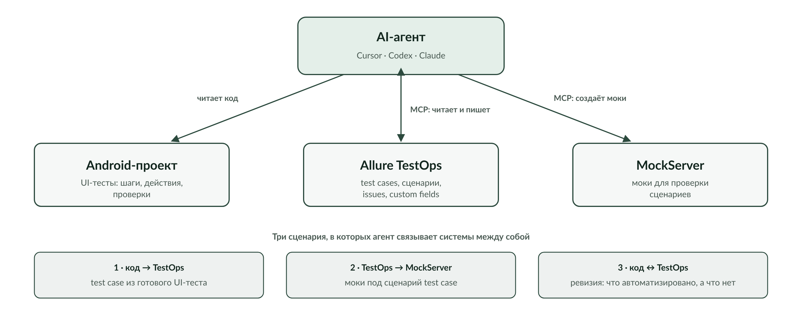

# Я ускорил разработку AI-агентами. Узким местом стало тестирование

Разработчики в нашей команде довольно быстро перешли на работу через coding agents. По моим ощущениям, скорость разработки выросла в разы: значительная часть рутинной работы с кодом ушла агентам.

Но соседние процессы от этого автоматически быстрее не стали.

В какой-то момент особенно хорошо это стало видно на тестировании. Моя коллега-тестировщица была сильно загружена. Я пришёл к ней с простым вопросом:

> Чем тебе можно помочь?

Из этого вопроса в итоге вырос небольшой [MCP-сервер для Allure TestOps](https://github.com/hram/allure-testops-mcp).



И эта история оказалась для меня интереснее самого MCP. Потому что проблема была вовсе не в том, что TestOps неудобно открывать в браузере.

Проблема была в другом: разработчик уже работает через AI-агента, а тестировщик всё ещё вручную переносит информацию между кодом, TMS и другими инструментами.

## До MCP всё работало. Просто вручную

До этого никакой MCP-интеграции с TestOps у нас в рабочем процессе не было. Был обычный web-интерфейс Allure TestOps.

Через него создавались test cases, их вручную сопоставляли с автоматизированными тестами, вручную следили за тем, чтобы документация не расходилась с кодом. Если для теста требовались моки, их тоже готовили отдельно.

Сам по себе браузер здесь не проблема. Для человека он вполне подходит.

Проблема появляется, когда часть работы уже делает AI-агент.

Представим простую задачу: в коде есть готовый UI-тест, и на его основе нужно создать test case в TestOps.

Без интеграции получается примерно такой процесс:

```text
AI-агент
    ↓
объясняет человеку, что нашёл в коде
    ↓
человек открывает TestOps
    ↓
создаёт или редактирует test case
    ↓
возвращается к агенту
```

То есть агент умеет анализировать код, но на границе TestOps внезапно останавливается. Дальше человек становится транспортным слоем между двумя системами.

Мне хотелось убрать именно это место.

## Код теста уже почти является тестовой документацией

В нашем Android-проекте много UI-тестов.

Они устроены довольно похоже на то, как тесты описываются в TMS: есть последовательность шагов, в каждом шаге выполняется действие, после него идут проверки.

Условно структура выглядит так:

```text
Шаг 1
  действие
  проверки

Шаг 2
  действие
  проверки

Шаг 3
  действие
  проверки
```

То есть большая часть информации для test case уже существует — только не в TestOps, а в коде.

После появления MCP я могу сказать агенту примерно следующее:

> Создай test case на основе этого теста.

Дальше агент сам читает исходный UI-тест, разбирает его шаги и проверки и создаёт соответствующий test case в Allure TestOps.

Здесь для меня важен не сам факт генерации текста.

Агент не придумывает тестовую документацию с нуля. Источником является код реально существующего автоматизированного теста. MCP нужен только для того, чтобы результат анализа можно было сразу записать в систему, где живёт тестовая документация.

Без MCP одни и те же знания приходится вручную переносить из одного представления в другое.

С MCP обе стороны доступны агенту.

```text
Android UI-test → AI-агент → TestOps
```

Это первый полезный сценарий.

Но дальше стало интереснее.

## Когда один MCP начинает работать вместе с другим

У нас есть ещё MCP для MockServer.

И тогда агенту можно поставить уже другую задачу:

> Создай мок для проверки test case из TestOps.

Теперь источником становится не код, а тестовая модель.

Агент читает test case из TestOps, понимает сценарий и через другой MCP создаёт один или несколько необходимых моков.

Получается цепочка:

```text
TestOps → AI-агент → MockServer
```

И вот здесь, на мой взгляд, лучше всего видно, зачем вообще давать агенту доступ к инженерным системам.

Если рассматривать MCP только как способ нажимать за человека кнопки в TestOps, выгода действительно выглядит сомнительно. Человек может открыть браузер и сделать всё сам.

Но агент с доступом сразу к нескольким системам решает другую задачу. Он переносит не текст из одного окна в другое, а **смысл** между инструментами.

В одном месте описано, что нужно проверить. В другом нужно подготовить окружение для этой проверки. Агент видит обе стороны и может связать их в одной задаче.

```text
                  ┌──────────────┐
                  │   AI-агент   │
                  └──────┬───────┘
                         │
             ┌───────────┼───────────┐
             ↓           ↓           ↓
        Android code   TestOps   MockServer
```

Для меня это гораздо важнее, чем автоматизация отдельного web-интерфейса.

## А какие тесты у нас вообще уже автоматизированы?

Третий сценарий вырос из той же идеи.

Есть набор test cases в TestOps. Есть набор UI-тестов в Android-проекте.

Периодически нужно понять, насколько они соответствуют друг другу:

- какие test cases уже автоматизированы;
- какие ещё нет;
- для каких UI-тестов есть соответствующая документация;
- где тест в коде уже изменился, а описание осталось старым.

Вручную это означает открыть две системы и постепенно сопоставлять сущности.

У coding agent уже есть доступ к исходному коду. После подключения TestOps MCP он получает и вторую сторону.

Теперь ему можно поручить саму ревизию.

Это уже не похоже на обычный CRUD через API. Здесь полезность возникает из контекста модели: она читает две разные формы описания одного процесса и пытается найти соответствия между ними.

Именно такие задачи я сейчас считаю самыми интересными для MCP.

## Что пришлось дать агенту

Сам сервер получился небольшим.

Это standalone stdio MCP на Node.js. На текущем этапе он предоставляет десять инструментов для работы с Allure TestOps: можно искать и читать test cases, создавать и удалять их, читать и обновлять сценарии, работать с issues и custom fields.

Подключение описано для Cursor, Codex и Claude.

Отдельно пришлось учитывать особенности самого TestOps API. Например, сценарии могут храниться в двух форматах: старом плоском `/scenario` и древовидном `/step`. Клиент умеет читать оба варианта.

Это как раз тот тип деталей, который почти не виден пользователю MCP, но без которого инструмент перестаёт быть надёжным на реальных данных.

При этом я сознательно не хочу превращать эту статью в документацию по десяти tools. Их список — не самая интересная часть проекта.

Гораздо важнее, какие задачи становятся возможны после того, как эти tools появляются в рабочем контексте агента.

## Почему MCP стал отдельным проектом

Первая реализация TestOps-интеграции появилась внутри моего `meta-agent`.

Но довольно быстро возник практический вопрос: как этим будет пользоваться тестировщик?

У неё есть Cursor. Заставлять её разворачивать мой `meta-agent` только ради доступа к TestOps не имело смысла.

Поэтому интеграцию вынесли в отдельный MCP-сервер.

Теперь это независимый инструмент: его можно подключить непосредственно к coding-agent окружению и использовать без всей остальной моей инфраструктуры.

Для меня это тоже важный критерий качества внутренних AI-инструментов.

Пока инструмент существует только внутри окружения его автора, он решает мою личную проблему. Когда его можно передать коллеге и подключить к её агенту, он становится частью рабочего процесса команды.

## Код MCP я не писал

Есть ещё одна деталь, которая для этой серии статей принципиальна.

Сам код этого MCP я не писал вообще. Его на 100% написал coding agent.

Моей работой были постановка задачи и проверка результата.

На первый взгляд можно сказать, что моя роль просто уменьшилась. На практике она скорее сместилась.

Мне нужно было понять, **что именно стоит автоматизировать**.

Можно было попросить агента сделать что угодно: web-обёртку, скрипт, ещё одну панель, набор команд. Но полезным решением оказался не интерфейс поверх TestOps, а доступ к тем сущностям, которые агенту нужны для сквозной работы.

Нужно было решить, какие операции открыть агенту.

Нужно было проверить их на реальном TestOps.

Нужно было понять, что инструмент должен быть отдельным от `meta-agent`, потому что пользоваться им будет другой человек в Cursor.

И главное — нужно было увидеть саму проблему не как «Тестировщик много работает в TestOps», а как:

> разработка уже стала агентной, а человек всё ещё вручную соединяет агента с остальной инженерной инфраструктурой.

Код в этой истории оказался относительно простой частью.

## Но доступ на запись — это уже ответственность

У MCP есть и менее приятная сторона.

Чем больше агент умеет делать самостоятельно, тем внимательнее приходится относиться к операциям записи.

Например, текущая реализация обновления scenario в TestOps неатомарна.

Она сначала удаляет существующий сценарий, а затем создаёт новые шаги последовательными запросами.

Упрощённо:

```text
DELETE current scenario
POST step 1
POST step 2
POST step 3
...
```

Rollback нет.

Значит, если процесс оборвётся между удалением старого сценария и завершением записи нового, test case теоретически может остаться с частично восстановленным или пустым сценарием.

У меня нет подтверждённого реального инцидента с такой потерей данных, поэтому было бы неправильно изображать это как уже случившуюся проблему.

Но по коду риск существует.

И это хорошее напоминание: MCP не превращает внешний сервис в безопасную песочницу. Если мы разрешаем агенту менять данные, его инструменты должны проектироваться как нормальный production-клиент: с валидацией, тестами, понятной семантикой операций и, где возможно, защитой от частичных изменений.

В standalone-версии сейчас есть шесть тестов, и они проходят. Но некоторые операции записи, например изменение issues/custom fields и удаление test case, отдельными тестами не покрыты.

То есть у проекта есть вполне конкретное направление для усиления.

## Так зачем агенту MCP, если я могу открыть браузер?

Могу. И тестировщик может.

Вопрос оказался поставлен не совсем правильно.

MCP нужен не затем, чтобы человек больше никогда не открывал TestOps.

Он нужен затем, чтобы человек не был обязательным посредником в каждой операции между AI-агентом и TestOps.

Как только агент получает доступ сразу к нескольким частям инженерного контура, появляются задачи другого уровня:

```text
код → TestOps

TestOps → MockServer

код ↔ TestOps
```

Создать test case из реально существующего UI-теста.

Прочитать test case и подготовить под него моки.

Сопоставить тестовую документацию с автоматизацией и найти пробелы.

По отдельности все эти действия человек способен выполнить через браузер, IDE и другие инструменты.

Но если для каждого перехода между системами нужен человек, агентная разработка заканчивается на границе IDE.

Для меня главный результат этого небольшого проекта именно в этом.

Мы не придумали ещё один способ управлять TestOps.

Мы начали убирать человека из роли транспортного протокола между кодом, TMS и AI-агентом — оставляя ему постановку задачи и проверку результата.

Этот проект — только одна из историй о том, как я использую AI-агентов в реальной разработке. У меня накопилось уже несколько таких проектов: от Android-инструментов и MCP-сервисов до личных порталов, автоматизации и DSP. Я собрал их на отдельной странице — [«Созвездие AI-проектов»](https://hram.github.io/project-galaxy.html).

Там можно посмотреть, что уже сделано, какие задачи я отдавал агентам и во что эти эксперименты в итоге превратились. Если какой-то проект покажется вам особенно интересным — напишите. Вполне возможно, следующая статья будет именно о нём.
