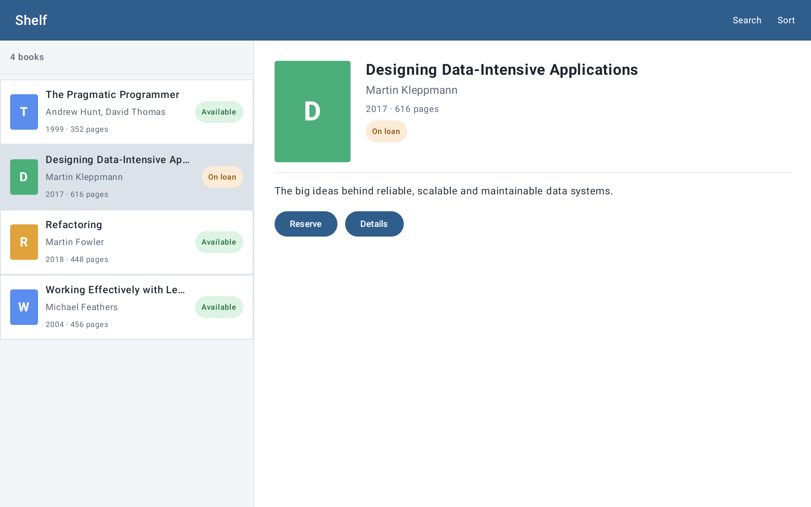

# Фича, за которую я бы сам не взялся: как coding agent добавил Jetpack Compose в Android UI Renderer MCP

Недавно я сделал [Android UI Renderer MCP](https://github.com/hram/android-ui-renderer-mcp) — локальный MCP-сервер, который позволяет coding agent рендерить Android-интерфейс без эмулятора и устройства, получать PNG и затем проверять геометрию элементов по дереву компонентов.

Изначально он работал с классическим Android UI: XML/View, `RecyclerView`, Activity + Fragment, оверлеями и разными конфигурациями экрана.

Сегодня я решил проверить следующий очевидный вопрос: **а что с Jetpack Compose?**

По старым меркам я бы назвал поддержку новой UI-технологии отдельной вехой проекта. По нынешним — это оказалась обычная доработка, которую я сформулировал для coding agent утром, а через пару часов в `main` уже был новый MCP-tool, тесты, отдельный Compose demo-проект и семь воспроизводимых сценариев.

Но для меня самое интересное здесь даже не скорость.

**Если бы эту поддержку пришлось делать самому, я бы вообще за неё не взялся.**

Не потому, что задача нерешаемая. Я просто не представлял, как именно к ней подойти, а объём предварительного исследования легко мог перебить весь выигрыш от самой фичи.

И вот это, кажется, гораздо важнее очередной истории «AI написал код быстрее».

## Почему Compose нельзя было просто «добавить ещё одним layout»

Для XML у renderer уже был понятный путь.

Есть layout resource. Его можно загрузить, применить fixture с тестовыми данными, измерить, разложить View hierarchy, нарисовать её в PNG и сериализовать дерево.

Упрощённо:

```text
XML layout
    ↓
inflate
    ↓
fixture с данными
    ↓
measure / layout
    ↓
PNG + View tree
```

С Compose такой точки входа нет.

Нет XML-файла, который можно просто `inflate`. Есть Kotlin-функция:

```kotlin
@Composable
fun BookItem(
    book: Book,
    selected: Boolean,
    onClick: () -> Unit
)
```

Чтобы её отрендерить, мало знать имя функции. Нужно понять её сигнатуру, собрать корректные Kotlin-значения параметров, разобраться с `enum`, nullable-типами, data class, коллекциями, callback'ами, темой — и только потом вызвать composable внутри среды, где Compose вообще сможет отрисоваться.

А в реальном приложении рядом быстро появляются `ViewModel`, DI, navigation и загрузка данных.

То есть первоначально вопрос выглядел не как «добавить поддержку ещё одного формата UI», а как довольно отдельная исследовательская задача.

И именно такие задачи я раньше чаще всего просто не начинал.

Технически сделать можно почти всё. Но сначала нужно понять, **куда копать**, какие ограничения фундаментальны, что можно обойти, а что потребует изменения архитектуры. Если стоимость этого исследования больше ценности фичи — фича остаётся в списке «когда-нибудь».

С coding agent порог оказался другим.

## Первое предложение агента я отверг

Самый осторожный вариант был логичным: пусть каждый Compose-проект сам предоставляет специальный renderer entry point.

То есть проект заранее знает, как создать нужное состояние, подставить зависимости и вызвать composable, а MCP только запускает этот подготовленный адаптер.

Работать могло бы.

Но для меня это убивало основную идею инструмента.

Я делал renderer не ради ещё одного тестового framework внутри Android-проекта. Мне нужен был инструмент, который агент подключает к существующему проекту и сразу использует в цикле:

```text
изменил UI
    ↓
отрендерил
    ↓
посмотрел PNG и структуру
    ↓
исправил
```

Если перед этим разработчик должен вручную написать специальный adapter для каждого экрана, автономность агента снова заканчивается там, где начинается реальный UI.

Поэтому я задал другое ограничение:

> **MCP должен сам адаптироваться к Kotlin/Compose. Проект не должен писать специальный renderer entry point.**

Вот здесь хорошо видно, что моя работа в этой задаче уже отличалась от привычной.

Я не знал, **как** реализовать такой механизм. Я задал свойство, которым должен обладать результат.

Дальше исследованием и реализацией занялся coding agent.

## Что получилось

В MCP появился отдельный tool `render_compose`.

Вместо XML-layout агент передаёт fully qualified name top-level composable и обычные именованные JSON-аргументы:

```json
{
  "function": "io.github.example.ComposeBookItem",
  "arguments": {
    "selected": true,
    "book": {
      "title": "Designing Data-Intensive Applications",
      "status": "AVAILABLE"
    }
  },
  "widthPx": 1280,
  "heightPx": 800,
  "densityDpi": 240
}
```

Дальше renderer:

1. находит Kotlin-файл с нужной top-level `@Composable`;
2. разбирает параметры функции;
3. проверяет лишние и отсутствующие аргументы;
4. строит из JSON типизированные Kotlin-значения;
5. генерирует обычный Kotlin-вызов composable;
6. для пропущенных callback'ов подставляет no-op lambda;
7. находит project-level `AppTheme` либо использует явно переданный wrapper;
8. создаёт временный Kotlin probe;
9. запускает его через Gradle/Robolectric;
10. рисует `ComposeView` в PNG.

Важный момент: исходники Android-проекта для этого не меняются. Временный probe живёт в `.android-ui-renderer`.

Поддержаны не только примитивы, но и nullable-значения, enum, data class, mutable properties, `List` и `Set`.

То есть агенту не пришлось заранее готовить специальную функцию вида `renderForMcp()` внутри каждого приложения.

| XML/View | Jetpack Compose |
| --- | --- |
|  |  |

_Один и тот же demo-экран: слева XML/View, справа Jetpack Compose. Оба
рендера сняты на canvas 1920×1200 px при 240 dpi; renderer получает
сопоставимый результат через разные механизмы._

Для проверки я попросил агента сделать не один искусственный composable, а **полный клон открытого sample-проекта на Jetpack Compose**.

В репозитории теперь лежат два эквивалентных Android-приложения:

- `sample/` — XML/View;
- `sample-compose/` — Jetpack Compose.

У обоих одна и та же небольшая библиотека книг и семь одинаковых сценариев: строка книги, длинный заголовок с `fontScale = 1.3`, список, master-detail, полный экран, loading state и русская тёмная тема.

В README я специально попросил расположить результаты XML и Compose рядом.

Это гораздо нагляднее фразы «Compose теперь поддерживается». Можно просто открыть README и увидеть: один и тот же сценарий проходит через два принципиально разных UI-стека, а renderer в обоих случаях получает изображение и структурированное представление экрана.

Важно только не трактовать эти картинки как pixel-perfect тест между XML и Compose. Цель другая: показать, что renderer умеет воспроизводить эквивалентные состояния на одинаковом canvas.

## Первый PNG появился — и всё равно ничего ещё не работало

Самый полезный сбой случился почти сразу.

На реальном Compose-компоненте агент получил нормальный PNG. Визуально результат уже был.

Можно было бы сказать: «готово».

Но дальше сломалась сериализация дерева.

Один из Compose semantics nodes не содержал `className`, который существующий протокол renderer'а ожидал от узлов дерева. В результате картинка была, а полноценный ответ MCP — нет.

Для обычного screenshot tool это могло бы быть мелочью.

Для agent tool — это принципиальная разница.

Мне нужен renderer не для того, чтобы агент просто «посмотрел глазами» на PNG. После рендера он должен иметь возможность спросить:

```text
где находится этот элемент?
какие у него bounds?
какой текст?
clickable ли он?
selected?
checked?
что находится внутри?
```

Для XML эту информацию даёт View tree.

В Compose вместо него renderer теперь возвращает **semantics tree**: `bounds`, `text`, `contentDescription`, `enabled`, `clickable`, `selected`, `checked` и дочерние nodes.

Агент исправил несовместимость, добавив fallback для semantics node без обычного Android `className`, пересобрал renderer и повторил тот же реальный запрос.

После этого прошёл уже не просто screenshot, а весь контракт инструмента: **изображение + структура**.

Для меня это хороший пример того, почему «AI умеет нарисовать экран» и «AI получил инструмент для автономной UI-разработки» — совсем не одно и то же.

Вот фрагмент публичного `view-tree.json` из этого demo. У node есть не только
текст, но и пригодные для следующего действия agent'а границы и состояние:

```json
{
  "id": "semantics-33",
  "className": "androidx.compose.ui.semantics.SemanticsNode",
  "clickable": true,
  "bounds": { "left": 650, "top": 500, "right": 799, "bottom": 560 },
  "children": [{
    "id": "semantics-35",
    "text": "Reserve",
    "bounds": { "left": 686, "top": 515, "right": 763, "bottom": 545 }
  }]
}
```

## Потом demo сломался уже не на Compose

Следующий сбой оказался вообще в другом месте.

Renderer временно добавляет необходимые test dependencies через Gradle init script. В новом Compose demo это упёрлось в строгий `repositoriesMode`: проект запрещал такой способ добавления зависимости Robolectric.

То есть сама UI-часть уже работала, но воспроизводимый открытый demo — нет.

Для `sample-compose` режим репозиториев изменили на `PREFER_PROJECT` и оставили комментарий, зачем renderer должен иметь возможность временно добавить test dependency.

Это тоже характерная часть агентной разработки.

Когда говоришь «добавь Compose», реальная работа не заканчивается на Compose API. Агенту приходится пройти весь путь до воспроизводимого результата: Gradle, test runtime, сериализация, demo-проект, артефакты.

Иначе получается не инструмент, а локальный эксперимент, который однажды сработал на машине автора.


## От вопроса до двух commit'ов — меньше двух часов

По журналу сессии первая фиксация технической проблемы была в 12:26.

В 12:41 я отверг обязательный project-side entry point.

Примерно к 13:00 первый реальный Compose render уже дал PNG, но сломался на semantics tree.

Затем был повторный успешный прогон, проблема с Gradle policy в открытом demo, тесты и генерация семи сценариев.

В 14:05 в `main` ушёл основной commit: поддержка Compose, тесты и Compose demo.

В 14:09 — второй, после моего замечания про разные размеры картинок.

То есть от формулировки технического барьера до исправленного публичного результата прошло около **1 часа 43 минут**.

Я специально не превращаю это в сравнение «человек сделал бы за N дней, агент за два часа».

Я не знаю, сколько дней заняла бы такая реализация у меня.

Потому что мой реальный ответ проще: **сам я, скорее всего, вообще не стал бы её начинать**.

Мне пришлось бы сначала отдельно изучать, как программно вызывать произвольный composable, что происходит с Compose compiler transformations, каким способом строить параметры, как получить semantics tree, как всё это посадить на Robolectric и как не превратить проект в набор специальных тестовых entry point'ов.

Конечно, всё это можно исследовать.

Но именно стоимость этого исследования и была бы главным стоп-фактором.

Coding agent поменял не столько скорость набора кода, сколько **экономику решения «стоит ли вообще пробовать эту идею»**.

## Что в итоге сделал агент, а что сделал я

Если смотреть только на git diff, может показаться, что моя роль почти исчезла.

Основную техническую работу действительно сделал coding agent:

- спроектировал и реализовал `render_compose`;
- сделал генератор типизированного Kotlin-вызова;
- построил Compose probe и semantics tree;
- добавил unit test для enum, data class, mutable state и callback;
- проверил renderer на реальном Compose-компоненте;
- создал отдельный открытый `sample-compose`;
- сделал семь воспроизводимых сценариев;
- исправил найденные по дороге проблемы.

Я не писал этот код руками.

Но мои задачи сместились в другое место.

Я определил, **какого решения не хочу**: никакого обязательного project-side adapter.

Я определил требуемое свойство системы: существующий Android-проект должен оставаться обычным проектом, а адаптация JSON → Kotlin/Compose должна быть ответственностью MCP.

Я разрешил проверку на реальном рабочем компоненте, а не только на игрушечном demo.

И я поймал ошибку в критериях визуального сравнения, когда формально рабочие XML/Compose renders оказались сняты на разных canvas.

Получается интересная смена ролей.

Раньше цепочка для меня выглядела бы примерно так:

```text
изучить неизвестную технологическую область
    ↓
найти архитектурный подход
    ↓
реализовать
    ↓
отладить
    ↓
написать тесты
    ↓
сделать demo
    ↓
проверить результат
```

Теперь значительная середина этой цепочки может уйти агенту:

```text
сформулировать требуемое свойство системы
    ↓
задать архитектурные ограничения
    ↓
agent: research → implementation → tests → demo → fixes
    ↓
проверить, что получился именно нужный результат
```

Это не означает, что техническая сложность куда-то исчезла.

Она осталась в коде.

Просто мне больше не обязательно самому проходить весь исследовательский путь до того, как я вообще получу право решить: полезна эта идея или нет.

## Это пока не «любой Compose-проект»

Здесь важно не переоценивать результат.

Текущая реализация намеренно ограничена.

Renderer работает с **top-level composable**, а не запускает production navigation flow. Он не поднимает DI и не загружает реальные данные приложения. Визуальное состояние передаётся явно аргументами.

Callback'и пока заменяются no-op lambda — renderer не симулирует полноценное взаимодействие пользователя.

Разбор Kotlin-сигнатур сейчас сделан собственным parser'ом на основе регулярных выражений, а не Kotlin compiler API. Поэтому сложные overload'ы, typealias, нестандартные annotations и другие нетривиальные конструкции могут потребовать дальнейшей работы.

Для Compose возвращается semantics tree, а не Android View tree, поэтому идентификаторы там synthetic.

Наконец, я не проверял pixel-perfect совпадение с физическим устройством и такого свойства пока не заявляю.

Но для моей исходной задачи этого достаточно: coding agent получил способ взять конкретный визуальный state, отрендерить реальный Compose UI, увидеть PNG и получить машинно-читаемую структуру результата — без заранее написанного адаптера внутри проекта.

## Главный результат для меня — не Compose

Формально результат этой доработки очень простой:

**Android UI Renderer MCP теперь поддерживает и XML/View, и Jetpack Compose.**

В README лежат два одинаковых sample-приложения на разных UI-стеках, а их рендеры показаны рядом.

Но лично для меня эксперимент оказался про другое.

Ещё недавно я оценивал сложность фичи вопросом:

> «Сколько времени мне понадобится, чтобы разобраться, как это вообще сделать?»

И именно на этом этапе многие полезные, но необязательные идеи умирали.

Сейчас всё чаще можно начать с другого вопроса:

> «Могу ли я достаточно точно сформулировать, каким должен быть результат и какие ограничения для меня принципиальны?»

В случае Compose я не знал реализации. Более того, я бы даже не стал начинать её исследовать самостоятельно.

Зато я точно знал, чего хочу от инструмента: никакого специального кода в каждом проекте, один прямой MCP-вызов, воспроизводимый render, PNG плюс структура для дальнейшей автоматической проверки.

Этого оказалось достаточно, чтобы агент сам прошёл неизвестную для меня техническую часть и довёл её до работающего публичного demo.

Наверное, именно здесь я сильнее всего чувствую изменение своей роли как разработчика.

**AI-agent не просто делает знакомые задачи быстрее. Он снижает порог, после которого ранее «невыгодная для исследования» инженерная идея вообще становится задачей, которую имеет смысл попробовать.**
