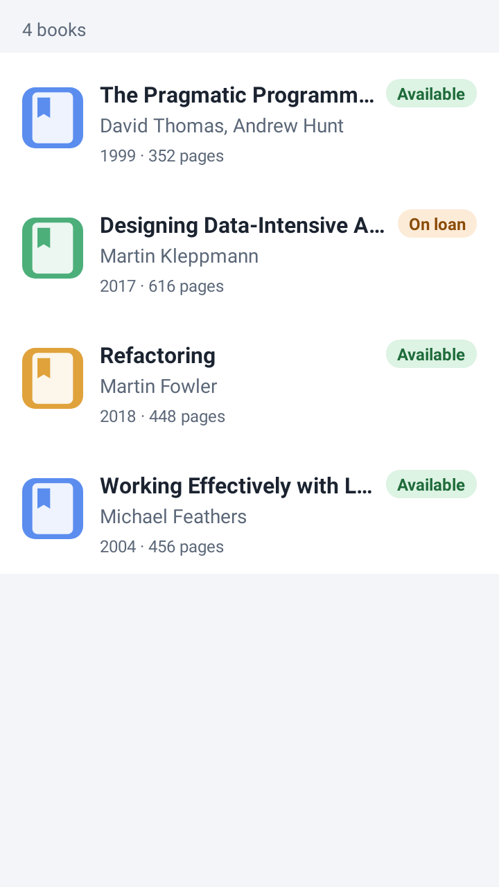
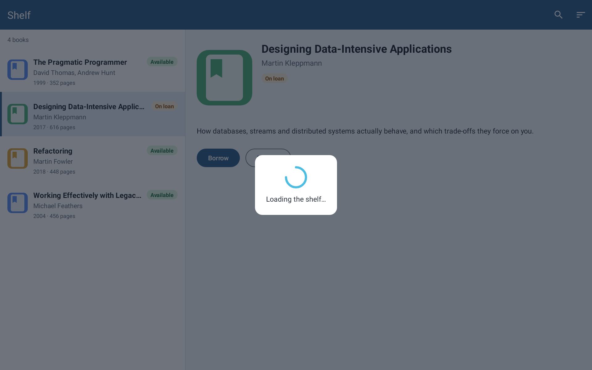

# Одного layout оказалось мало: как я научил coding agent собирать Android-экран без запуска приложения

В [первой статье про Android UI renderer]({{ '/articles/android-ui-renderer-mcp/' | relative_url }})
я описал, как [сам проект](https://github.com/hram/android-ui-renderer-mcp) дал
coding agent'у возможность видеть результат изменений Android XML: задача тогда
казалась почти решённой.

Coding agent мог взять XML-layout, отрендерить его через Robolectric, получить PNG и View Tree с координатами элементов. То есть он уже не просто менял XML вслепую, а видел результат и мог проверять геометрию.

Но как только я принёс в renderer настоящий экран рабочего приложения, выяснилось, что одного layout недостаточно.

Реальный экран — это Activity shell, Fragment-контейнер, RecyclerView с данными, состояния вроде loading overlay. Если просто запустить production Fragment, вместе с ним потянутся DI, навигация, сеть и остальной runtime приложения.

А мне было нужно другое: дать агенту достаточно настоящий экран для визуальной проверки, но не запускать само приложение.

Так появилась следующая версия renderer.

> Все изображения в статье — рендеры открытого демо-приложения из того же
> репозитория ([`sample/`](https://github.com/hram/android-ui-renderer-mcp/tree/main/sample)).
> Экран, на котором renderer дорабатывался, принадлежит рабочему приложению, и
> показать его я не могу. Демо повторяет ту же структуру — Activity с тулбаром,
> Fragment, RecyclerView, master-detail, loading overlay — и каждую картинку
> можно получить заново из запроса, лежащего рядом.

## Где закончился простой screenshot renderer

Первая версия хорошо работала с изолированными XML-layout.

Схема была примерно такой:

```text
XML
  ↓
Robolectric
  ↓
inflate → fixture → measure → layout → draw
  ↓
PNG + View Tree
```

Для отдельных карточек, строк списков и простых экранов этого уже достаточно.

Но затем я выбрал для проверки настоящий экран рабочего Android-проекта. Сам проект я объявил read-only полигоном: агент мог изучать его ресурсы и проверять renderer на изолированной копии, но не должен был менять приложение.

И тут быстро проявилась новая граница.

Экран состоял не из одного XML. Был Activity layout, внутри него контейнер Fragment, внутри Fragment — RecyclerView. Для нормального вида списка нужны строки с данными и selected-состояния. Отдельно хотелось уметь показывать loading overlay.

То есть задача изменилась.

Мне больше не нужен был renderer одного layout. Мне нужен был renderer **составного экрана**.

## Настоящий UI без настоящего runtime

Самый очевидный путь — поднять Fragment как в приложении.

Но именно этого я не хотел.

Production Fragment почти никогда не существует сам по себе. За ним могут стоять ViewModel, DI-контейнер, navigation graph, репозитории, сеть, база данных и десятки деталей, которые вообще не относятся к задаче «проверь, как выглядит экран».

Если тащить всё это в renderer, он быстро превратится в ещё один способ запускать приложение — только гораздо сложнее обычного эмулятора.

Поэтому границу провели иначе:

```text
Activity XML          — настоящий
Fragment XML          — настоящий
item layout           — настоящий
drawable              — настоящий

Fragment runtime      — не запускаем
DI                    — не запускаем
navigation            — не запускаем
network               — не запускаем
данные                — задаём явно
```

Это оказалось главным архитектурным решением новой версии.

Renderer должен использовать настоящие UI-ресурсы приложения, но runtime-состояние получать из детерминированного запроса.

## Activity и Fragment как составная цель

Для этого появился отдельный режим `render_target`.

Сейчас он поддерживает цель `activity_fragment`.

Renderer надувает XML Activity, находит в нём нужный контейнер, отдельно надувает XML Fragment и вставляет его внутрь.

Production Fragment-класс при этом вообще не запускается.

Упрощённо получается так:

```text
activity_main.xml
        ↓
   container
        ↓
fragment_screen.xml
        ↓
   composed screen
```

В запросе это четыре поля:

```json
{
  "target": {
    "kind": "activity_fragment",
    "activityLayout": "activity_main",
    "containerId": "fragmentContainer",
    "fragmentLayout": "fragment_library"
  },
  "widthPx": 1920,
  "heightPx": 1200,
  "densityDpi": 240,
  "orientation": "landscape"
}
```

Результат на демо-приложении — Activity с `MaterialToolbar` и master-detail фрагментом внутри `FragmentContainerView`:


*Заголовок и иконки меню тулбара пришли из XML (`app:title`, `app:menu`): код Activity не выполнялся. Справа — детали через `<include>`, их значения тоже заданы в запросе.*

Это важное различие.

Я не пытаюсь эмулировать lifecycle настоящего Fragment. Мне нужен его визуальный результат из реальных ресурсов проекта.

Для задачи coding agent этого часто достаточно: он меняет XML и должен понять, что получилось на экране.

## RecyclerView пришлось тоже сделать детерминированным

Следующая проблема появилась почти сразу.

Даже если Activity и Fragment собраны правильно, пустой RecyclerView мало что говорит о реальном интерфейсе.

При этом запускать production adapter и получать настоящие данные из приложения опять не хотелось.

Поэтому данные списка стали частью render request.

Для RecyclerView запрос задаёт:

- настоящий `itemLayout` приложения;
- ориентацию;
- набор строк;
- fixture для каждой строки.

Renderer создаёт временный adapter, надувает настоящий XML элемента списка и применяет переданные значения.

Например, можно явно задать текст, visibility или drawable selected-состояния. Одна строка из запроса выше — выбранная книга:

```json
{
  "@id/title": { "text": "Designing Data-Intensive Applications" },
  "@id/cover": { "image": { "type": "drawable_resource", "value": "@drawable/cover_green" } },
  "@id/statusBadge": { "text": "On loan", "backgroundDrawable": "@drawable/bg_badge_on_loan", "textColor": "#8A4B08" },
  "@id/root": { "selected": true, "backgroundDrawable": "@drawable/bg_book_row_selected" }
}
```

Тот же `item_book` в отдельном фрагменте со списком на экране размера телефона:



Получается интересная граница: **структура UI настоящая, данные тестовые и полностью контролируемые**.

Renderer ничего не угадывает и не пытается извлечь бизнес-данные из `tools:*`. Если агент хочет увидеть три строки списка — он должен описать эти три строки в запросе.

Для воспроизводимости это гораздо полезнее магии.

## Макет стал источником тестовых данных

Во время работы я дал агенту макет нужного экрана и попросил использовать его как источник тестовых данных для render.

То есть задача агента была не просто «сделай поддержку RecyclerView».

Он должен был приблизить render к конкретному рабочему экрану, сохраняя при этом read-only режим для самого приложения.

Параллельно я уточнил профиль реального планшета.

Для проверяемого сценария использовался landscape-профиль:

```text
экран: 1280×800
доступная область приложения: 1280×728
densityDpi: 240
fontScale: 1.0
locale: ru-RU
night mode: false
```

72 пикселя снизу занимала системная навигация.

Для обычного screenshot это может показаться мелочью. Для проверки геометрии — уже нет. Если агент сравнивает bounds элементов, он должен работать в той же доступной области, что и реальный экран.

## Потом появились overlays

Когда основной экран начал собираться, я перешёл к временным состояниям.

Один из сценариев — loading overlay поверх Activity + Fragment.

Здесь снова проявилась разница между «похоже на приложение» и «воспроизводимо для агента».

Обычный indeterminate ProgressBar анимируется. Если сделать несколько screenshot подряд, его состояние может отличаться.

Для человека это не проблема.

Для автоматической визуальной проверки — лишний источник недетерминированности.

Поэтому перед draw indeterminate ProgressBar замораживается в статичное состояние.



*В запросе overlay — это ещё один XML-layout со своим fixture: `view_loading_overlay` и `@id/loadingRoot` с `visibility: visible`.*

Renderer не доказывает, что анимация работает правильно. Он доказывает другое: индикатор есть, он находится в нужном месте и занимает ожидаемую геометрию.

Это ровно та степень реальности, которая нужна для этой задачи.

## В какой момент я понял, что screenshot всё ещё недостаточно

Во время одного из render я заметил ещё одну проблему.

Результат сохранялся: PNG есть, View Tree есть.

Но параметры, которыми этот результат был получен, рядом не сохранялись.

То есть через некоторое время можно открыть красивую картинку — и уже не знать точно:

- какой MCP tool был вызван;
- с какими аргументами;
- какой project root использовался;
- какой module и variant;
- какой Gradle test task запускался.

Получался воспроизводимый renderer с невоспроизводимой историей запуска.

Это особенно интересно потому, что предыдущую статью я закончил именно выводом: следующим шагом должны стать structured run logs.

Через несколько дней реальная работа заставила сделать первый кусок такого журнала.

Теперь каждый sidecar-run сохраняет два дополнительных файла:

```text
request.json
replay.json
```

`request.json` содержит нормализованный запрос.

`replay.json` — рецепт запуска: MCP tool, аргументы, project root, module, variant и test task. Для экрана с overlay выше он выглядит так (аргументы сокращены):

```json
{
  "format": "android-ui-renderer-mcp/replay/v1",
  "tool": "render_target",
  "arguments": {
    "target": { "kind": "activity_fragment", "activityLayout": "activity_main", "containerId": "fragmentContainer", "fragmentLayout": "fragment_library" },
    "widthPx": 1920, "heightPx": 1200, "densityDpi": 240, "orientation": "landscape",
    "overlays": [{ "layout": "view_loading_overlay", "fixture": { "@id/loadingRoot": { "visibility": "visible" } } }]
  },
  "project": { "root": "sample", "module": ":app", "variant": "debug", "testTask": ":app:testDebugUnitTest" }
}
```

В результате render session теперь выглядит уже не как «вот PNG, который однажды получился», а как маленький инженерный эксперимент, который можно повторить на той же ревизии проекта и версии renderer.

## Открытое демо нашло то, чего не нашёл рабочий проект

Демо-приложение появилось позже основной работы — как замена картинкам, которые нельзя показать. Но оно оказалось полезно не только для иллюстраций.

В рабочем проекте, на котором renderer дорабатывался, JUnit уже был в тестовых зависимостях — как и в любом проекте из стандартного шаблона Android Studio.

В демо тестовых зависимостей сначала не было, и первый же рендер упал:

```text
error: package org.junit does not exist
```

Renderer запускает свой временный probe как JUnit 4-тест и добавлял в проект только Robolectric. JUnit он молча ожидал найти в самом проекте. На рабочем проекте это ни разу не проявилось, потому что JUnit там был.

Исправление небольшое: JUnit 4.13.2 добавляется на время рендера, только если проект его не объявил. Проект со своим JUnit 4.12 остаётся на 4.12 — это проверено по тестовому classpath, а не по надежде.

Вторая находка касалась уже самого демо: в ночной теме outlined-кнопка оказалась почти невидимой, потому что основной цвет темы совпал с тёмным тулбаром. Её показал сценарий с `nightMode: true`, а не просмотр XML.

И ещё одно наблюдение. При повторных прогонах всех семи сценариев на той же машине PNG совпали с сохранёнными байт в байт. Для экспериментов с `replay.json` это важнее, чем кажется: повтор даёт не «похожую» картинку, а ту же самую.

А на строке списка с длинным названием и `fontScale: 1.3` видно, зачем рядом с PNG нужен View Tree:


```json
"textLayout": { "textSizePx": 40.0, "maxLines": 1, "lineCount": 1, "ellipsisCount": 81, "truncated": true }
```

Границы заголовка не изменились, картинка выглядит нормально, но 81 символ заменён многоточием. Кстати, 16sp при `fontScale: 1.3` дают 40 px, а не 41,6: начиная с Android 14 крупный текст масштабируется нелинейно.

## Что в этой работе делал агент, а что делал я

В этой итерации у меня сохранился подробный worklog, поэтому разделение ролей можно восстановить гораздо точнее, чем в предыдущем эксперименте.

Я выбрал реальный экран как полигон и сразу запретил менять рабочее приложение. Затем поставил задачу научить renderer показывать RecyclerView, дал макет с тестовыми данными, уточнил профиль реального планшета.

Позже отдельно остановил работу перед изменениями вокруг overlay и dialog: сначала попросил изучить проблему, ничего не меняя.

После анализа я уточнил желаемые режимы рендера и выбрал отдельный `render_target`, а не перегрузку старого `render_layout`.

Ещё позже я заметил, что render нельзя воспроизвести только по сохранённому каталогу результата, потому что аргументы вызова теряются. Отсюда появились `request.json` и `replay.json`.

Coding agent со своей стороны исследовал XML реального экрана и ограничения текущего renderer, предложил deterministic adapter для RecyclerView, реализовал поддержку списков и drawable-состояний, затем composed Activity + Fragment target, overlays и сохранение replay-рецепта.

Проверки он выполнял на изолированной копии рабочего проекта, не изменяя сам проект.

В конце я вручную проверил composed render с loading overlay и только после этого дал команду обновить документацию и зафиксировать изменения.

С демо-проектом было так же: состав экранов — отдельный item, фрагмент со списком, master-detail, Activity с тулбаром целиком — определил я. Приложение, запросы рендера и исправление зависимости JUnit написал агент; вариант «добавлять JUnit только если его нет» тоже был моим уточнением.

Для меня это важнее формулировки «агент написал 578 строк».

Человек здесь не набирал большую часть кода вручную. Но именно человек определял, **какую границу реальности должен моделировать инструмент и чего он делать не должен**.

## Что получилось

После этой итерации renderer умеет собирать составной Android-экран из реальных ресурсов проекта:

```text
Activity layout
    +
Fragment layout
    +
RecyclerView rows
    +
fixtures
    +
overlay
    ↓
PNG + View Tree + replay data
```

При этом он не запускает production Fragment, DI, navigation или network.

На рабочем проекте сохранены end-to-end renders реального экрана: composed Activity + Fragment, вариант с fixtures и вариант с loading overlay, рядом — View Tree. Публично то же самое можно проверить на демо: для каждого из семи сценариев в репозитории лежат запрос, PNG, View Tree и `replay.json`.

Тесты проекта проходят, а сама доработка зафиксирована отдельным commit.

Но границы результата тоже важны.

Сейчас поддержан только composed target типа `activity_fragment`: один контейнер, один fragment layout. Поэтому master-detail в демо — это один fragment layout, а не два фрагмента.

RecyclerView получает только явно переданные локальные строки. Pagination, async loading и настоящий data source не моделируются.

Статический spinner позволяет проверить присутствие и геометрию loading state, но ничего не говорит о корректности его анимации.

И это всё ещё не замена устройству.

## Самый важный результат оказался не в новом API

Сначала я думал об этом проекте как о способе дать coding agent screenshot Android UI.

Потом выяснилось, что screenshot без View Tree недостаточно проверяем.

Теперь выяснилось ещё одно: даже настоящий View Tree одного layout недостаточен, если реальный экран собирается из нескольких уровней и состояний.

Каждый следующий шаг упирается не столько в генерацию картинки, сколько в вопрос:

**какую часть реального приложения нужно сохранить настоящей, а какую можно заменить детерминированной моделью?**

Для UI renderer мой текущий ответ такой:

Настоящими должны оставаться ресурсы и геометрия интерфейса.

Контролируемыми и явными должны быть данные и runtime-состояние, которые нужны только для воспроизводимого render.

А сам эксперимент должен оставлять после себя не только PNG, но и достаточно информации, чтобы его можно было повторить.

Именно в этом месте инструмент для coding agent перестаёт быть просто «глазами».

Он становится средой, в которой результат работы агента можно не только увидеть, но и воспроизвести.
