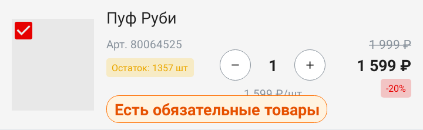
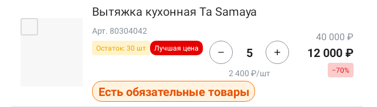

# Я дал coding agent глаза для Android UI — но картинки оказалось мало

Когда coding agent меняет Android XML, он довольно уверенно работает с тем,
что можно прочитать: находит layout, понимает constraints, вносит diff. Но
дальше почти всегда возникала ещё одна ручная точка в процессе: я открывал
экран и решал, правда ли кнопка, текст или карточка оказались на своём месте.

Мне хотелось убрать именно это повторяемое переключение. Не передать агенту
ответственность за продукт и не объявить эмулятор ненужным, а сделать
результат его правки доступным в том же рабочем цикле, где он редактирует код.

Первой мыслью был screenshot: агент меняет XML, получает картинку и смотрит на
неё. На практике это оказалось только половиной решения.

## Ещё один ручной шаг

Обычная проверка Android UI устроена для человека. Можно открыть Preview,
запустить эмулятор, взять устройство или прогнать screenshot-тест. Во всех
случаях в критической точке нужен мой взгляд. Агент может честно описать
свой diff, но из этого не следует, что layout действительно собрался так, как
нужно.

Для XML/View-экранов я хотел получить более короткий контур:

```text
изменить XML → отрендерить → проверить результат → исправить
```

Рендеринг я вынес в локальный MCP на Kotlin/JVM с Robolectric. Агент передаёт
layout и явно заданные данные для него, а в ответ получает результат рендера.

MCP здесь не главный персонаж. Это всего лишь способ убрать меня из
повторяемого промежуточного шага: не запускать рендер вручную и не передавать
агенту результат самому.

Важна и граница задачи. Это инструмент для XML/View-проектов, а не замена
устройству. Он не обещает совпадения с физическим телефоном пиксель в
пиксель, не предназначен для Compose и не пытается эмулировать аппаратные
поверхности, видео или камеру.

## Я дал агенту screenshot

PNG сразу сделал результат видимым. Агент мог увидеть, что интерфейс выглядит
подозрительно: текст обрезан, блок неожиданно исчез, два элемента явно
наезжают друг на друга. Это уже лучше, чем менять XML вслепую.

На этом месте проект очень хотелось считать почти готовым. Screenshot
генерируется, MCP отвечает, `inspect_view` существует — формально основные
части на месте.

Но повторная ревизия быстро разрушила это ощущение.

Screenshot был настоящим, а View tree sidecar возвращал искусственный
корневой узел. У такого «дерева» нельзя спросить о реальной дочерней View,
поэтому инструмент с названием `inspect_view` почти ничем не помогал.

И тут стало понятно, что сама картинка решает далеко не всё.

Она плохо отвечает на вопросы, которые обычно решают судьбу UI-правки:
каково фактическое расстояние между двумя View, вышел ли элемент за границу
экрана, где именно расположен нужный `id`. Человек может прикинуть это глазом.
Агенту нужна не только иллюстрация, но и проверяемые данные.

Одновременно coding agent обратил внимание ещё на одну слишком простую идею:
нельзя просто один раз поднять Robolectric runtime и бесконечно использовать
его после изменений XML или Kotlin. Иначе он рискует смотреть на устаревшие
ресурсы и classpath.

Это замечание скорректировало архитектуру и убрало соблазн выдать «прогретую
JVM» за уже решённую задачу.

## Результат нужно не только видеть, но и измерять

Поворот был простым по формулировке и важным по последствиям: PNG и данные
должны рождаться из одного и того же уже разложенного layout.

После `inflate → fixture → measure → layout → draw` renderer сохраняет
картинку и настоящее View tree. В узле дерева есть идентификатор, тип, текст и
состояние, padding, margins и абсолютные bounds.

Поэтому агент может сначала увидеть экран, а затем обратиться к конкретной
View и проверить координаты.

У этого контура три небольших действия: `render_layout` создаёт render
session, `get_view_tree` возвращает её дерево, а `inspect_view` даёт один узел
по `id`.

Для этой истории важны не сами имена API, а возможность перейти от:

> «Кажется, здесь слишком близко»

к измеряемому факту — например, сравнить край кнопки с краем контейнера, не
снимая размеры с PNG на глаз.

Так появился geometry feedback loop:

```text
change → render → inspect → evidence → fix
```

Картинка помогает заметить проблему, дерево даёт геометрию, следующая правка
снова проходит через тот же рендер.

Внутри есть ещё fingerprint исходников и разрешённый Gradle pipeline, которые
не дают молча рендерить устаревшее состояние или передавать произвольную
shell-команду. Но это опора надёжности цикла, а не его сюжет.

## Кульминация: настоящий layout, а не учебный пример

После всех этих доработок я подключил MCP к реальному рабочему
Android-проекту.

Coding agent использовал его при исправлении настоящего layout товарной
карточки с блоком обязательных товаров.



*До исправления: карточка товара с блоком обязательных товаров в проблемном layout.*



*После исправления: та же карточка после UI-правки, выполненной с использованием feedback loop.*

Для меня это и было главным acceptance test: инструмент вышел из RFC и собственных unit-тестов в реальную UI-задачу.
Созданный feedback loop работает на настоящем Android layout и был использован coding agent в реальной UI-правке.

Следующий подобный эксперимент я уже хочу сохранять полностью: prompt,
инструментальные вызовы, render IDs, XML diff, измерения и итоговый verdict.

## Что эксперимент действительно доказал

| Что я хотел проверить | Результат |
| --- | --- |
| Можно ли рендерить настоящий Android XML/View layout через MCP + Robolectric | Да |
| Можно ли получать вместе с PNG настоящее машинно читаемое View tree | Да |
| Использовал ли coding agent этот контур в реальной UI-правке | Да |
| Можно ли по сохранённым данным полностью воспроизвести действия агента | Пока нет |

При этом я не считаю, что получил замену эмулятору или устройству. Robolectric
не гарантирует pixel-perfect совпадение с железом, у меня нет compatibility
matrix для всех custom Views и сложных тем, а default sidecar пока не является
той самой постоянно прогретой JVM, которая была в раннем архитектурном плане.

Это нормальные ограничения первой версии. Важнее другое: теперь границу
возможностей инструмента можно описывать фактами, а не впечатлением от
удачного screenshot.

## Роль инженера не исчезла

В этой истории я не передал агенту право «решать UI».

Я сформулировал ограниченную проблему, задал границы поддержки, не принял PNG
за достаточное доказательство и несколько раз возвращал работу к проверяемым
критериям.

Coding agent при этом был не просто генератором кода. Он участвовал в
реализации, заметил риск устаревшего Robolectric runtime и помог построить и
применить сам контур.

Главный результат для меня не в том, что у coding agent появилась картинка.

Один screenshot делает интерфейс видимым. PNG вместе с View tree делает его
проверяемым.

Именно так исчезает ручной просмотр из обычного цикла: не потому, что я решил
просто доверять агенту, а потому, что он получает артефакты, которые можно
измерить и перепроверить.

Репозиторий: [android-ui-renderer-mcp на GitHub](https://github.com/hram/android-ui-renderer-mcp).
