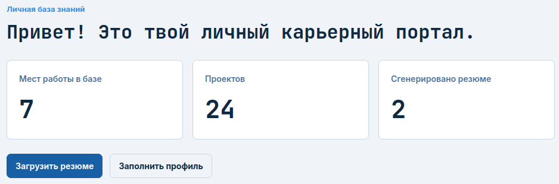
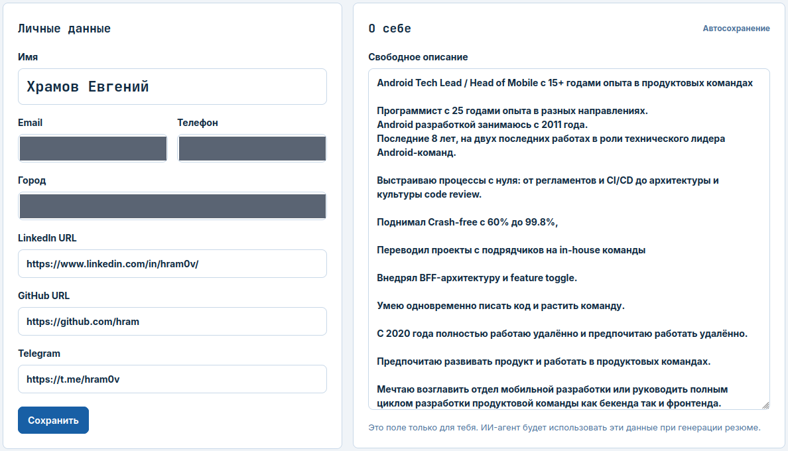
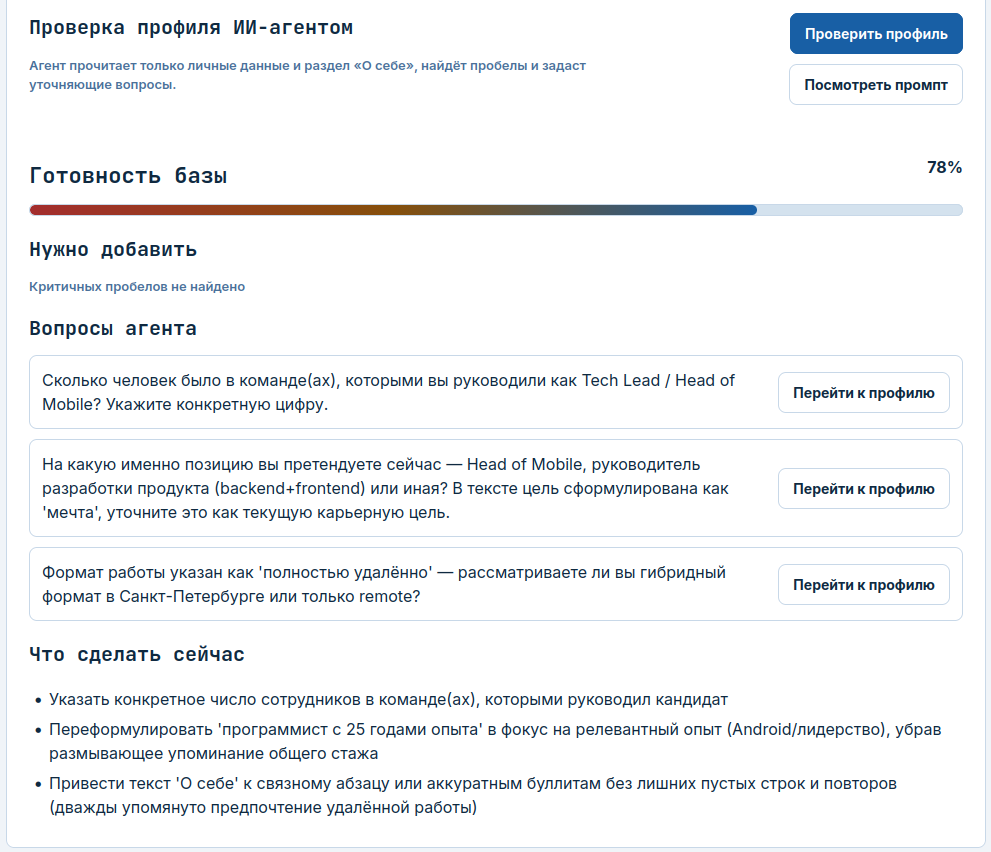
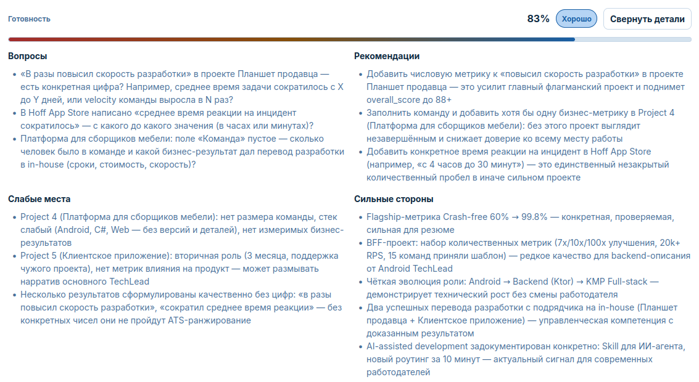
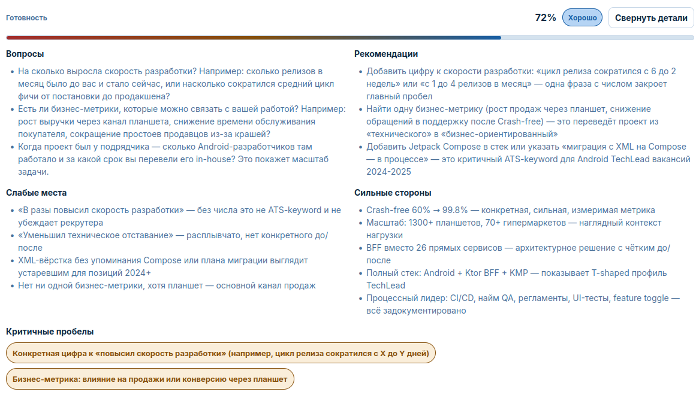
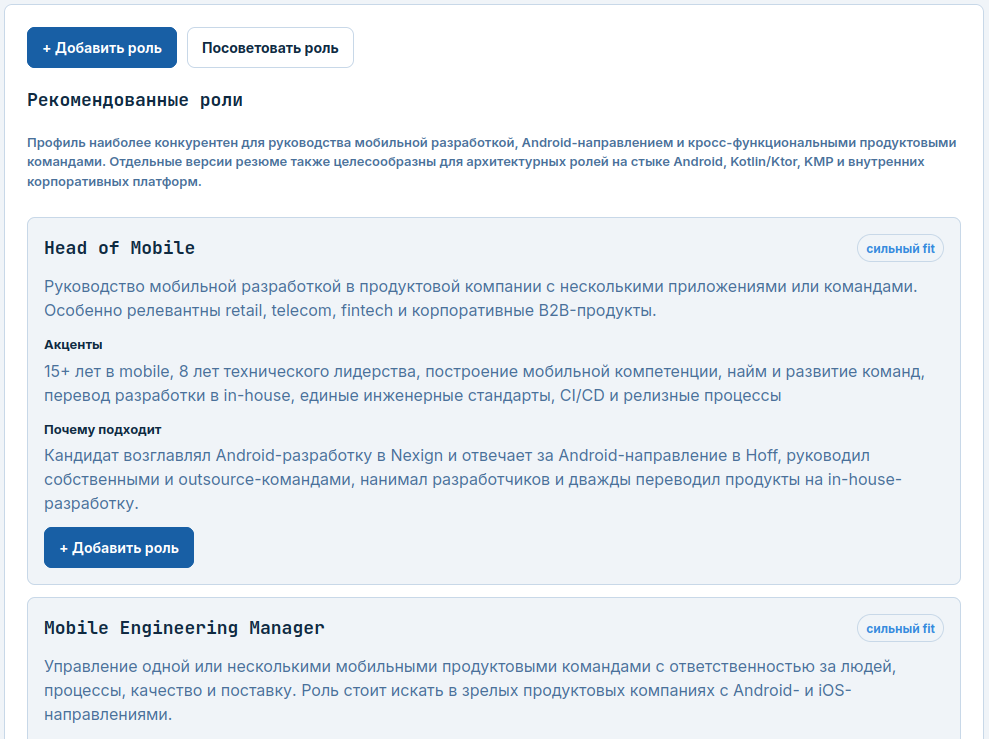
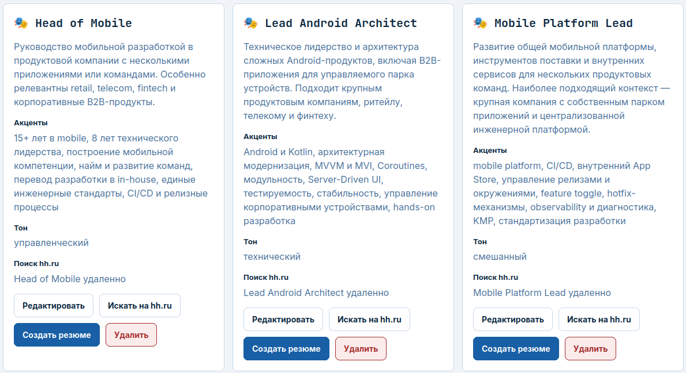
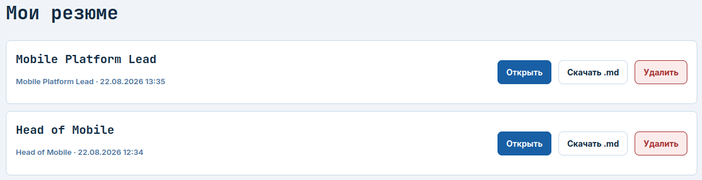

# Я хотел улучшить резюме с AI. В итоге пришлось построить базу фактов о собственной карьере



Я хочу найти новую работу. Казалось бы, задача знакомая: открыть hh.ru, обновить последние места работы, добавить несколько достижений и начать откликаться.

У меня этот сценарий сломался раньше, чем я дошёл до формулировок.

Последние полгода мой способ разработки сильно изменился. Всё больше механической работы — изучение проекта, написание кода, правки, рефакторинг, часть анализа — я отдаю AI-агентам. Формально я всё ещё разработчик и техлид. Но чем дальше, тем хуже привычная строчка «Android Tech Lead» описывает то, чем я на самом деле занимаюсь.

И у меня появился неприятный вопрос: **а какую работу мне вообще искать дальше?**

Можно было открыть старое резюме и дописать туда «работаю с Claude и Codex». Но это выглядело как попытка решить новую проблему старым способом.

Так появился Career Portal.

Сначала я думал о нём как о более удобном способе готовить резюме с AI. В итоге резюме оказалось последним шагом. Основной системой стала приватная база знаний о собственной профессиональной жизни.

## Почему я не хотел начинать с hh.ru

У публичного резюме есть странное свойство: любая мысль сразу должна выглядеть как готовая публикация.

Иногда я хочу просто записать: мне понравилось заниматься такой задачей; эту роль я больше не хочу; на этом проекте я фактически был не только Android-разработчиком; здесь я руководил людьми, но не помню точный размер команды; вот это достижение кажется важным, но я пока не умею его сформулировать.

Это ещё не резюме. Это материал для будущего резюме.

Есть и более практический барьер. Я не хочу, чтобы каждая промежуточная правка публичного CV воспринималась как сигнал «я снова обновляю резюме». Мне нужно место, где можно спокойно думать о карьере, не публикуя каждую мысль.

Поэтому в Career Portal появился обычный приватный раздел «О себе». Туда можно писать достаточно свободно. Система прямо говорит: это поле только для меня, а AI будет использовать его как контекст позже.



На этом месте проект начал расходиться с типичным AI Resume Builder.

Обычный сценарий выглядит примерно так:

```text
старое CV + вакансия → LLM → улучшенное CV
```

Проблема в том, что старое CV уже является сильно урезанной версией моей профессиональной истории. Если я десять лет что-то не считал важным и не записывал, модель этого тоже не знает.

Поэтому я развернул задачу:

```text
сначала факты и контекст → потом AI → и только потом резюме
```

## Резюме перестало быть хранилищем моей карьеры

В Career Portal я храню профиль, места работы, проекты, навыки и заметки.

Ключевой момент — контекст разделён по уровням.

- **Профиль** — кто я вообще и чего хочу.
- **Место работы** — какую роль я выполнял в этот период.
- **Проект** — что конкретно я делал здесь, каким стеком, в какой роли и с каким результатом.

Это может показаться избыточным, пока не пытаешься описать несколько лет работы в одной компании.

Например, в одной компании у меня может быть Android-проект, где я отвечаю за мобильное приложение и команду. Рядом — BFF на Kotlin/Ktor, где я уже выступаю как backend-разработчик и архитектор. Ещё где-то появляются KMP, внутренние инструменты, CI/CD или платформенные задачи.

Если положить всё в одно большое поле «Опыт работы», AI очень легко смешает контексты. Технология из одного проекта окажется рядом с достижением другого, а роль Tech Lead начнёт автоматически распространяться на работу, где я был обычным разработчиком.

Поэтому для меня важным принципом стало: **недостаточно сохранить факт — нужно сохранить контекст, в котором этот факт был правдой.**

## Самая полезная функция AI оказалась не генерацией текста

После заполнения профиля можно нажать «Проверить профиль».

Я ожидал примерно привычного набора советов: сократить текст, переставить абзацы, сделать формулировки сильнее.

Вместо этого агент начал задавать вопросы.



Например, я написал, что руководил Android-командами. Агент спросил: **сколько именно человек было в командах?**

Я написал про полностью удалённую работу. Он уточнил: я рассматриваю гибрид в Санкт-Петербурге или только remote?

Я написал несколько возможных направлений карьеры. Он попросил определить, что из этого текущая цель, а что просто мечта или возможный вариант.

На уровне места работы вопросы становятся ещё неприятнее — в хорошем смысле.



Фраза «в разы повысил скорость разработки» перестаёт выглядеть достижением. Агент спрашивает: **во сколько раз? Был цикл релиза шесть недель и стал две? Был один релиз в месяц и стало четыре?**

Фраза «сократил время реакции на инцидент» вызывает следующий вопрос: с какого значения до какого?

Перевёл разработку от подрядчика in-house? Хорошо. А какого размера была команда? Какой был масштаб проекта? Что изменилось по срокам, стоимости или скорости?

На уровне проекта всё становится ещё конкретнее.



У меня есть сильная цифра: Crash-free вырос примерно с 60% до 99,8%. Здесь агенту почти нечего улучшать — есть понятное «было → стало».

А рядом лежит фраза «в разы повысил скорость разработки». Для меня она понятна: я помню контекст и знаю, о чём говорю. Для человека, который впервые открыл резюме, это почти пустое утверждение.

И вот тут Career Portal неожиданно поменял моё представление о резюме.

Я всегда считал, что метрики — это в первую очередь территория менеджеров. Оказалось, если я хочу хорошо объяснить собственную работу, метрики нужны мне не меньше.

Сколько людей было в команде? Сколько устройств в эксплуатации? Сколько магазинов? Сколько релизов? Как изменилось время цикла? Какой был процент ошибок? Какой объём операций проходил через систему?

Не обязательно всё измерять деньгами. Но между «я улучшил процесс» и «было → стало» огромная разница.

Самым полезным результатом работы AI оказалось не то, что он умеет писать обо мне. **Он умеет спросить о том, чего я сам не догадался записать.**

## А потом AI задал более важный вопрос: кем этот опыт вообще может называться

Изначально моя проблема была не в том, что я не умею написать `Head of Mobile` красивыми словами.

Проблема была в том, что я не уверен, должен ли вообще искать `Head of Mobile`.

Это принципиально другой порядок действий.

Я не хочу сначала выбрать должность, а потом натягивать на неё биографию. Я хочу сначала максимально честно собрать то, что реально делал, а уже затем посмотреть, какие профессиональные роли из этого следуют.

Поэтому в Career Portal есть функция «Посоветовать роль».

AI смотрит на профиль, опыт, проекты, стек и результаты, а затем предлагает возможные варианты позиционирования и объясняет, почему они подходят.



В моём случае среди вариантов появились `Head of Mobile`, `Mobile Engineering Manager`, позже — `Lead Android Architect`, `Mobile Platform Lead` и другие направления.

Здесь для меня важна граница ответственности.

AI **не решает, кем мне быть**. Он предлагает гипотезу и показывает аргументы из моей же истории. Я могу принять роль, отредактировать её или вообще проигнорировать.

Это похоже не на профориентационный тест, а на взгляд со стороны: «если я вижу вот такой набор фактов, на рынке его можно попробовать собрать вот в такие роли».

## Одна биография — несколько резюме, и это нормально

Когда я сохраняю роль, она становится отдельным способом посмотреть на ту же базу знаний.



Это важная вещь, которую я раньше формулировал хуже.

`Head of Mobile`, `Lead Android Architect` и `Mobile Platform Lead` — не три разные версии меня. Это одна и та же профессиональная история с разным отбором фактов.

Для `Head of Mobile` логично поднять наверх управление командами, найм, перевод разработки in-house, инженерные стандарты, процессы релизов.

Для `Lead Android Architect` — Android/Kotlin, архитектурные решения, стабильность, модернизацию, hands-on работу.

Для `Mobile Platform Lead` — CI/CD, платформенные механизмы, feature toggles, KMP, внутреннюю инженерную инфраструктуру.

Если база фактов одна и AI запрещено придумывать достижения, это не «подгонка биографии под вакансию». Это нормальный выбор релевантной части реальной истории.

## И только теперь появляется генерация резюме

После выбора роли Career Portal может сделать две вещи.

Первая — помочь искать вакансии в этом направлении.

Вторая — собрать резюме под выбранную роль.

Если я нахожу конкретную интересную вакансию, можно пойти ещё уже и сформировать версию резюме под её требования.

Здесь я специально не хочу строить систему вокруг вопроса:

> «Подхожу ли я этой вакансии на 82%?»

Мне нужен другой вопрос:

> **«Что из моего реального опыта нужно показать, чтобы резюме отвечало требованиям этой вакансии?»**

Это разное отношение к задаче.

В первом случае система как будто выносит вердикт кандидату. Во втором вакансия становится контекстом для отбора и расстановки акцентов.

Результат сохраняется как отдельное резюме.



Последний шаг я оставляю ручным. Портал отдаёт результат в удобном для проверки и переноса виде — в интерфейсе и файлах, после чего я сам решаю, что именно публиковать.

Это не случайная мелочь. Я не хочу, чтобы агент сначала придумал роль, потом написал документ, а затем без человека отправил его наружу. Для карьерных данных такая автономность мне не нужна.

## На жене-бухгалтере выяснилось, что это не только проблема программиста

Позже я сделал портал многопользовательским и загрузил туда резюме жены. Она бухгалтер.

И тут повторился тот же паттерн.

Вместо общих фраз AI начал спрашивать:

- Сколько юридических лиц было в обслуживании?
- Сколько счетов заказчикам оформлялось в среднем за месяц?
- Сколько операций по списанию материалов?
- Какой ежемесячный объём?

То есть механизм оказался не связан с Android, Kotlin или архитектурой ПО.

Человек пишет: «занимался X».

AI отвечает: «какого масштаба был X и чем это можно подтвердить?».

А человек уже возвращается к своей реальной истории и дополняет её фактами.

Для меня это важнее, чем умение модели переставить слова в резюме.

## Как это сделано технически

Сам Career Portal довольно приземлённый по стеку: FastAPI, Jinja2 и SQLite. Я специально не строил вокруг идеи тяжёлый SPA.

В базе есть профиль, работы, вложенные проекты, навыки, образование, заметки, роли, сгенерированные резюме и данные для работы с вакансиями. Можно импортировать PDF/DOCX: сначала текст разбирается, затем строится preview, и только после подтверждения данные попадают в базу. Если профиль уже заполнен, разрушительная замена требует отдельного подтверждения.

AI-слой со временем тоже перестал быть привязан к одной модели: в проекте появились Claude CLI, Codex CLI и OpenAI-compatible provider. Интеграция с hh.ru добавилась уже после первого MVP.

У проекта сохранился интересный genesis-трейл. В master plan роли были записаны прямо: Claude в чате — архитектор, Claude Code — исполнитель, я — владелец.

Про авторство скажу прямо: весь код портала от начала до конца написал агент. Я не написал в нём ни строки и ни одной строки не читал. Моя часть — задача, роли, постановки и решения о том, каким должен быть продукт.

## Есть проблема: после всей этой работы мне всё равно почти никто не пишет

На этом месте очень хотелось бы закончить статью красиво.

Например: я построил систему, AI нашёл правильную роль, сделал идеальное резюме, после чего работодатели выстроились в очередь.

Такого результата нет.

Я сейчас использую портал для реального поиска работы. Резюме стало гораздо подробнее и доказательнее. Я нашёл множество дыр в собственной профессиональной истории, добавил метрики, по-другому посмотрел на роли.

Но звонков и сообщений почти нет.

Я не знаю почему.

Возможно, проблема в рынке. Возможно, в моём позиционировании. Возможно, в самом резюме. Возможно, я вообще оптимизирую не ту часть процесса.

Есть даже неприятная гипотеза: когда долго улучшаешь резюме вместе с AI, можно попасть в локальный максимум. Документ становится всё более логичным для меня и модели, но это ещё не означает, что он лучше работает в реальном найме.

Пока у меня нет данных, чтобы заявлять это как факт.

Именно поэтому я не называю Career Portal системой, которая «решила мой поиск работы».

Она решила другую проблему: дала мне место, где профессиональная история хранится отдельно от её публикаций; заставила превращать декларации в доказательства; помогла увидеть несколько возможных карьерных ролей; научила строить разные резюме из одной и той же базы фактов.

А эффективность этих резюме ещё должен доказать рынок.

## Что я из этого вынес

До этого проекта я воспринимал резюме как главный документ о собственной карьере.

Сейчас — как один из её временных срезов.

Главное находится раньше: факты, контекст, проекты, реальные роли, масштабы, цифры, предпочтения и ограничения.

Если эта база слабая, AI просто красиво перепишет слабый материал.

Если база хорошая, AI становится гораздо полезнее: он может найти пробел, задать неудобный вопрос, предложить неожиданный способ позиционирования и собрать из одной истории разные документы под разные задачи.

Но есть вещи, которые я ему не отдаю.

Он не решает, кем мне быть. Не придумывает мне достижения. Не определяет, стоит ли откликаться. И не публикует за меня финальную версию.

Пожалуй, главный результат проекта пока такой:

**я хотел, чтобы AI лучше писал обо мне. А оказалось, что сначала мне самому нужно гораздо лучше знать и доказывать собственную профессиональную историю.**

Этот проект — только одна из историй о том, как я использую AI-агентов в реальной разработке. У меня накопилось уже несколько таких проектов: от Android-инструментов и MCP-сервисов до личных порталов, автоматизации и DSP. Я собрал их на отдельной странице — [«Созвездие AI-проектов»](https://hram.github.io/project-galaxy.html).

Там можно посмотреть, что уже сделано, какие задачи я отдавал агентам и во что эти эксперименты в итоге превратились. Если какой-то проект покажется вам особенно интересным — напишите. Вполне возможно, следующая статья будет именно о нём.
