# Статья про family-messenger которой не случилось

Я не разработчик. Точнее, я разработчик — но этот проект я не кодил.
Вообще. Ни одной строки руками.

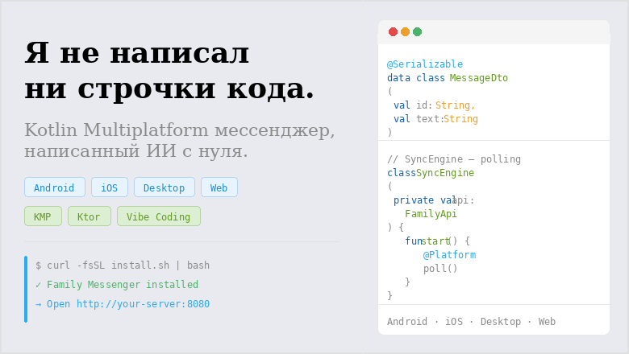

Всё написал Claude. Я только говорил что хочу.

Это статья про то, что из этого получилось — и про то, где ИИ справился,
а где пришлось думать самому.

---


## Что вышло

**Family Messenger** — self-hosted мессенджер для семьи.

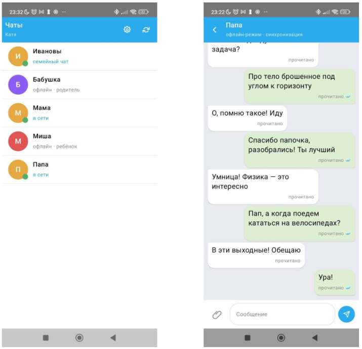
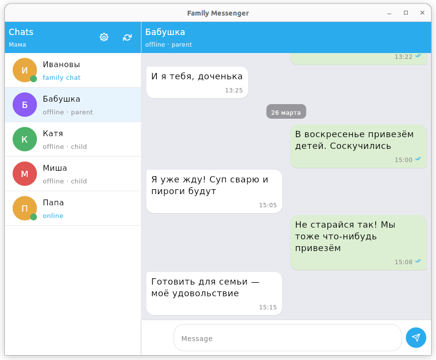
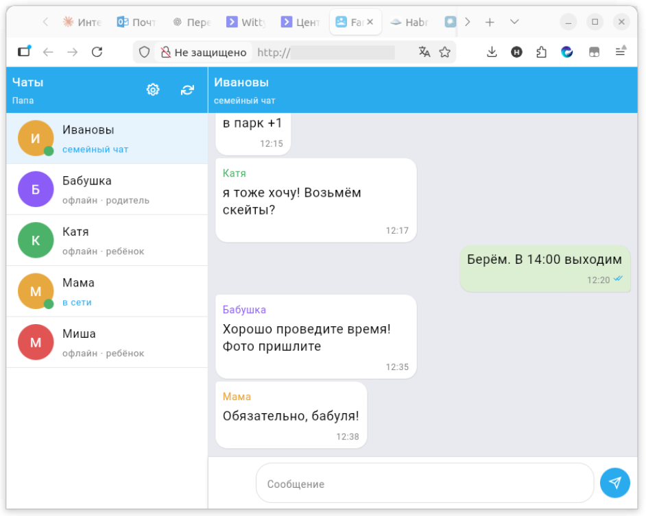

Монорепо, Kotlin Multiplatform, один кодовый базис для всех платформ:

- **Backend** — Ktor + Exposed + PostgreSQL
- **Android, iOS, Desktop, Web** — Compose Multiplatform, один UI на все платформы
- **Shared contract** — единый модуль с DTO, который шарится между бэком и всеми клиентами
- **Infra** — Docker, systemd, Caddy, install wizard, два окружения (prod/dev)

Проект живой, задеплоен, семья пользуется.

Сразу важная оговорка, чтобы потом не делать вид, что я о ней не знал:
сейчас внешний доступ к семейному серверу у меня поднят по `HTTP`, а не по
публичному доверенному `HTTPS`.

Это не потому, что я считаю открытый трафик нормой. Это осознанное ограничение
текущей стадии проекта. Я понимаю риск: без TLS трафик между клиентом и сервером
снаружи не защищён так, как должен быть защищён у продукта для реального
интернета.

Я для себя этот риск принял временно, потому что на данном этапе мне было важнее:

- проверить, что продукт вообще работает end-to-end на семье, а не только на локальном ноутбуке
- довести KMP-клиенты, backend, install wizard и deploy workflow до рабочего состояния
- понять, нужен ли проект семье в принципе, прежде чем вкладываться в доведение transport security до production-уровня

Но это именно временный компромисс, а не финальное решение.

---

## Стек

```
monorepo/
├── shared-contract/     # KMP, единый источник правды для API моделей
├── backend/             # Ktor (JVM), Exposed DSL, Koin 4.0
├── client/
│   └── composeApp/      # Compose Multiplatform
│       ├── androidApp/
│       ├── iosApp/
│       ├── desktopApp/
│       └── webApp/      # Kotlin/JS
└── infra/               # Docker Compose, install.sh, Caddy
```

Платформенные точки входа — тонкие обёртки. Вся логика в `commonMain`.

`expect`/`actual` только там где без этого не обойтись: HTTP-движок
(OkHttp / Darwin / JS fetch), secure storage, геолокация, нотификации.

---

## Архитектура

### Backend

Классический слоёный Ktor:

```
plugins/        ← Authentication, Routing, StatusPages, Serialization
routes/         ← HTTP handlers
service/        ← бизнес-логика (Auth, Profile, Message, Presence, Device)
repository/     ← интерфейсы + ExposedRepositories impl
db/Tables.kt    ← Exposed table definitions
```

Exposed DSL, не ORM. Тесты на H2 in-memory — никакого Docker в CI.

### Client

MVI через `AppViewModel`: UI-события → `AppState`.

`ClientCore.kt` — весь domain в одном файле:
`FamilyMessengerApiClient`, репозитории, use cases, `LocalDatabase`
(snapshot persistence), `SyncEngine` (polling), `SessionStore`.

Да, один файл. ИИ так решил. Я не спорил — работает.

### Shared Contract

Единственный источник правды для transport-моделей.
`ApiModels.kt`, `Requests.kt`, `Responses.kt` — шарятся между бэком
и всеми клиентами через KMP. Никакого дублирования DTO.

---

## Адаптивный layout: один UI для всех платформ

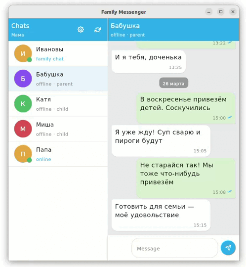

Одна из нетривиальных задач KMP — разные форм-факторы.
На мобильном нужна последовательная навигация (Contacts → Chat),
на десктопе и вебе — split-pane где список и чат рядом.

Решение через `BoxWithConstraints`:

```kotlin
@Composable
fun FamilyMessengerApp(viewModel: AppViewModel) {
    val state by viewModel.state.collectAsState()

    BoxWithConstraints {
        val isWide = maxWidth > 600.dp

        when {
            state.screen == Screen.ONBOARDING -> OnboardingScreen(...)
            isWide -> WideLayout(state, viewModel)   // Desktop/Web: split-pane
            else   -> MobileLayout(state, viewModel)  // Android/iOS: stack
        }
    }
}
```

Ключевой архитектурный приём — каждый экран разбит на две части:

- `ContactsScreen` / `ChatScreen` — полноэкранные обёртки для мобильного
- `ContactsPanel` / `ChatPanel` — переиспользуемый контент без топбара

`WideLayout` берёт те же `Panel`-компоненты и кладёт их рядом.
Никакого дублирования UI.

```kotlin
@Composable
private fun WideLayout(state: AppUiState, viewModel: AppViewModel) {
    Row(modifier = Modifier.fillMaxSize()) {
        Column(modifier = Modifier.width(280.dp).fillMaxHeight()) {
            TgTopBar(title = "Chats", ...)
            ContactsPanel(...)
        }
        VerticalDivider()
        Box(modifier = Modifier.weight(1f)) {
            if (state.selectedContactId != null) {
                Column {
                    TgTopBar(title = state.selectedContactName ?: "")
                    ChatPanel(state = state, viewModel = viewModel)
                }
            } else {
                EmptySelectionPlaceholder()
            }
        }
    }
}
```

`BoxWithConstraints` предпочтительнее `WindowSizeClass` для KMP —
работает без дополнительных зависимостей на всех таргетах включая WASM.

---

## Цветовая система как пример

Демонстрация палитры в интерактивном режиме Claude

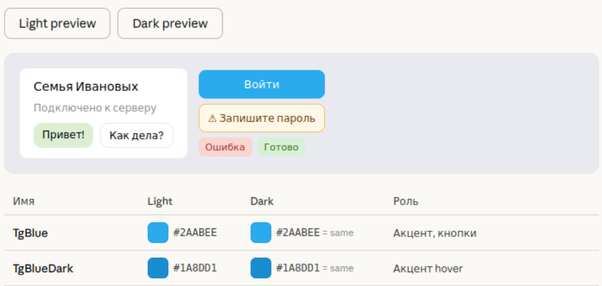

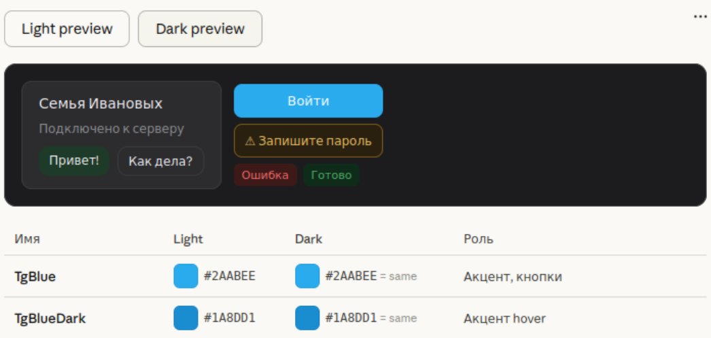

Один конкретный пример того, как работает вайбкодинг с правилами.

Я дал Claude требование: никаких хардкодных `Color(0xFF...)` в UI-файлах.
Все цвета — через `AppColorScheme` с light/dark значениями,
доступ только через composable-аксессор.

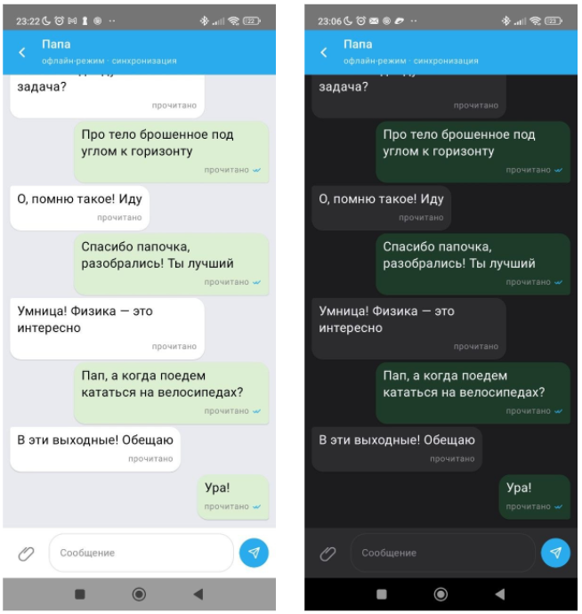

Вот как это устроено:

```kotlin
// AppColors.kt
data class AppColorScheme(
    val tgBlue: Color,
    val appBg: Color,
    val cardBg: Color,
    val textPrimary: Color,
    val bubbleMe: Color,
    // ... 28 именованных цветов
)

val LightColors = AppColorScheme(
    tgBlue      = Color(0xFF2AABEE),
    appBg       = Color(0xFFE9EAEF),
    bubbleMe    = Color(0xFFDCEFD2),
    // ...
)

val DarkColors = AppColorScheme(
    tgBlue      = Color(0xFF2AABEE),  // акцент не меняется
    appBg       = Color(0xFF1C1C1E),  // iOS-системный тёмный
    bubbleMe    = Color(0xFF1E3A28),
    // ...
)

val LocalAppColors = staticCompositionLocalOf { LightColors }

// Composable-аксессоры — единственный способ получить цвет в UI:
internal val TgBlue: Color
    @Composable get() = LocalAppColors.current.tgBlue

internal val AppBg: Color
    @Composable get() = LocalAppColors.current.appBg
```

```kotlin
// FamilyMessengerApp.kt
CompositionLocalProvider(
    LocalAppColors provides if (isSystemInDarkTheme()) DarkColors else LightColors
) {
    // весь UI автоматически получает правильную тему
}
```

Палитра из 28 именованных цветов. Claude держал это правило
по всему проекту — во всех экранах, компонентах, новых фичах.

Это и есть главный инсайт вайбкодинга: **правила работают лучше контроля**.
Описываешь инварианты один раз — получаешь их везде.
Единственное исключение — `Color.White` как tint на цветном фоне,
`Color.Black` и `Color.Transparent` — стандартные Compose-константы,
не нуждаются в именовании.

---

## Статусы сообщений и sticky date pill

Мессенджер без статусов доставки — не мессенджер.
Реализовали четыре состояния в стиле Telegram:
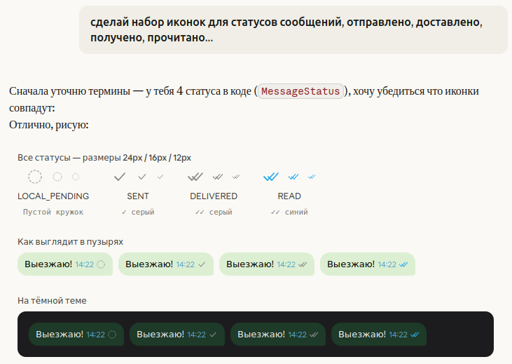

```kotlin
enum class MessageStatus {
    LOCAL_PENDING,  // кружок — сообщение не ушло на сервер
    SENT,           // ✓ серый — сервер принял
    DELIVERED,      // ✓✓ серый — дошло до устройства
    READ,           // ✓✓ синий — прочитано
}
```

Иконки — SVG-файлы в `commonMain/composeResources/drawable/`.
Ключевой момент при рендере:

```kotlin
Icon(
    painter = painterResource(message.status.iconResource()),
    tint = Color.Unspecified,  // цвет уже в SVG, не давать Compose перекрашивать
    modifier = Modifier.size(14.dp),
)
```

Для датных разделителей в чате сделали sticky pill — появляется при скролле,
исчезает через 1.2 секунды после остановки:

```kotlin
// Список сообщений разбиваем на sealed items
private sealed interface ChatItem {
    data class Message(val payload: MessagePayload) : ChatItem
    data class DateDivider(val label: String)       : ChatItem
}

// Pill реагирует на скролл через snapshotFlow
LaunchedEffect(listState) {
    snapshotFlow { listState.isScrollInProgress }.collectLatest { scrolling ->
        if (scrolling) pillVisible = true
        else { delay(1200); pillVisible = false }
    }
}
```

Строки для дат (`"сегодня"`, `"вчера"`, `"марта"`) — через `Res.string.*`.
Сама функция `buildChatItems()` не `@Composable`, поэтому строки
разрешаются в composable-контексте и передаются как параметры.

---

## QR-код для входа

Вместо ручного ввода invite-кода сделали QR-сканер.

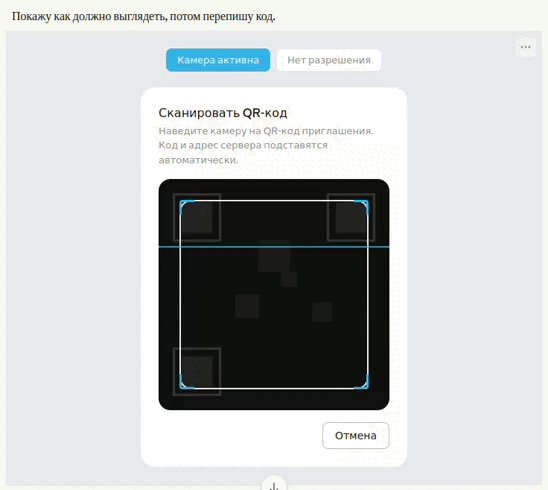

Работает только на Android и iOS — через `expect`/`actual`:

```kotlin
// commonMain
expect fun isQrScannerSupported(): Boolean
@Composable expect fun QrScannerSheet(onResult: (String?) -> Unit, onDismiss: () -> Unit)

// androidMain
actual fun isQrScannerSupported(): Boolean = true
// используем ZXing (journeyapps/zxing-android-embedded)

// desktopMain / wasmJsMain
actual fun isQrScannerSupported(): Boolean = false
```

QR-код содержит deeplink с кодом и адресом сервера:
```
familymessenger://join?code=XXXX-XXXX&url=http%3A%2F%2F192.168.1.10%3A8081
```

При сканировании оба поля заполняются автоматически.
На Desktop и Web кнопка сканера просто не рендерится:

```kotlin
if (isQrScannerSupported()) {
    QrScannerButton(onClick = { showQrScanner = true })
}
```

---

## Визард первичной настройки

Сервер — self-hosted. Первый запуск требует инициализации:
задать мастер-пароль администратора, создать участников, раздать invite-коды.

Визард доступен только в веб-версии — это принципиально,
потому что именно веб открывается при первом обращении к серверу.

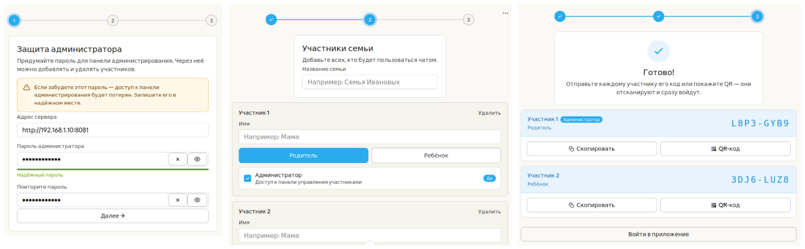

Три шага:

1. **Мастер-пароль** — защита панели администрирования.
   Не пароль входа — пароль управления. Предупреждение о невозможности восстановления.
2. **Участники** — имя, роль (Родитель / Ребёнок), флаг администратора.
   Администратором может быть только Родитель.
3. **Invite-коды** — генерируются автоматически в формате `XXXX-XXXX`.
   Для каждого участника — кнопки «Скопировать» и «QR-код».

Поле «Адрес сервера» в визарде не нужно — если ты видишь визард,
значит ты уже открыл его с нужного адреса.

Для размещения нескольких семей на одном сервере — разные порты:
```
myserver.com:8081  →  семья Ивановых
myserver.com:8082  →  семья Петровых
```
Каждый порт — отдельный Docker-стек со своей БД.

---

## Иконка приложения

Мелочь, но показательная.

Попросил Claude предложить варианты иконки. Получил 6 концепций в SVG прямо
в чате — интерактивный прототип с превью в трёх размерах и на тёмном фоне.

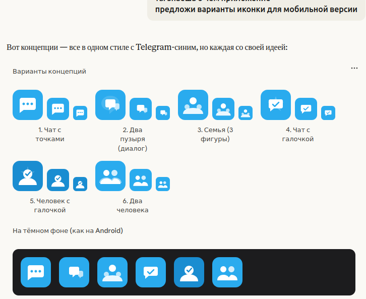

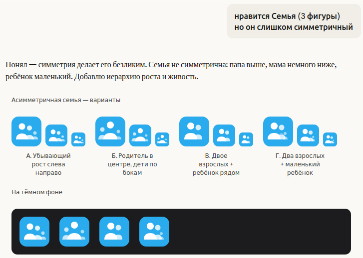

Выбрал концепцию «родитель-защитник»: крупная центральная фигура,
двое детей по бокам разного размера и высоты — намеренная асимметрия,
потому что настоящая семья не симметрична.

Финальный SVG в 1024×1024 — мастер для нарезки:

```bash
# Android
cairosvg ic_launcher.svg -o mipmap-xxxhdpi/ic_launcher.png -W 192 -H 192

# iOS (через iconutil на macOS)
mkdir icon.iconset
cairosvg ic_launcher.svg -o icon.iconset/icon_512x512.png -W 512 -H 512
iconutil -c icns icon.iconset -o icon.icns
```

Важный момент для Android: не использовать Adaptive Icon с `foreground`/`background`
если в foreground есть элементы с `opacity < 1`. На белом фоне foreground-файла
полупрозрачный белый выглядит серым. Проще положить финальный PNG с фоном
напрямую в `mipmap-*`.

---

## Ограничения и безопасность

Вот здесь важно быть честным. Если позиционировать это как
"готовый безопасный мессенджер для публичного интернета", это было бы
неправдой.

На текущем этапе у проекта есть понятные ограничения:

- внешний доступ к серверу у меня пока работает по `HTTP`
- invite-коды и сессия при внешнем доступе не защищены TLS-каналом
- transport security для публичного использования ещё не доведена до состояния "поставил родственникам и забыл"

Я это знаю, не скрываю и именно поэтому не называю проект
production-ready secure messenger.

### Почему я не включил HTTPS сразу

Проблема не в том, что `Caddy` не умеет TLS. `Caddy` умеет его отлично.
Проблема в том, что для нормального публичного `HTTPS`, который браузеры и
мобильные клиенты принимают без предупреждений, нужен **домен**.

Сертификат на голый IP вроде `https://83.95.243.147` не даёт нормального UX:

- self-signed сертификат шифрует трафик, но браузеры показывают scary warning
- на каждом устройстве нужно вручную устанавливать доверие к сертификату
- для семьи это превращается в постоянную ручную поддержку новых телефонов и браузеров

То есть шифрование канала технически можно сделать и без домена,
но удобный и доверенный `HTTPS` для обычных пользователей требует доменное имя.

### Что нужно, чтобы решить эту проблему правильно

Нормальный путь для этого проекта такой:

1. Купить или использовать свой домен.
2. Завести DNS-запись на сервер.
3. Перевести `Caddy` с `:8080` / `:9080` на доменные имена.
4. Дать `Caddy` автоматически выпустить сертификаты через Let's Encrypt.
5. Обновить клиентские `baseUrl` на `https://...`.

После этого проблема открытого внешнего трафика закрывается так, как и должна
закрываться в обычном веб-продукте.

### Почему статья всё равно имеет смысл

Мне важен не маркетинг "смотрите, я сделал идеальный безопасный мессенджер",
а честный инженерный разбор:

- что реально удалось собрать через ИИ
- где KMP и Compose Multiplatform уже практичны
- какие инфраструктурные решения работают
- где проект пока упирается в реальные эксплуатационные ограничения

На мой взгляд, полезнее честно показать незакрытый слой и план его решения,
чем делать вид, что проблемы нет.

---

## Это был не один промпт

Ещё одна важная вещь, которую хочется проговорить прямо:
этот проект не был результатом одного запроса в духе
"сделай мне мессенджер".

Всё началось с большого стартового мастер-промпта, а потом работа была
разрезана на последовательные этапы. Полные тексты лежат в репозитории,
их можно открыть и посмотреть целиком:

- `promts/prompt.md` — исходный мастер-промпт
- `promts/step_1.md`
- `promts/step_2.md`
- `promts/step_3.md`
- `promts/step_4.md`
- `promts/step_5.md`

**Полный текст промптов доступен в репозитории.**

И это, на мой взгляд, как раз самая честная часть всей истории про
вайбкодинг. Не "я сказал магические слова и всё появилось само", а
"я построил для ИИ нормальный процесс поставки".

### Стартовый промпт как контракт

Первый промпт был не про красоту формулировок, а про ограничения.
По сути это был документ уровня solution architect:

- что именно строим
- какие платформы обязательны
- какой backend стек допустим
- как должен выглядеть shared-contract
- какая infra считается приемлемой
- что нельзя использовать
- что считать MVP, а что не делать

Это и есть главный урок: для сложного проекта промпт должен быть не
"сделай приложение", а **контрактом на архитектуру и границы решения**.

### Почему шаги оказались критичны

После стартового контракта работа была разрезана на 5 шагов:

1. Сначала каркас монорепы, `shared-contract`, API и skeleton модулей.
2. Потом отдельно backend.
3. Потом отдельно infra и deploy.
4. Потом отдельно KMP-клиент.
5. Потом отдельный self-review как у principal engineer.

Это очень похоже на обычную инженерную практику:
сначала contract и boundaries, потом реализация по слоям, потом review.

Если бы всё это пытаться сделать одним заходом, ИИ почти наверняка
смешал бы:

- transport DTO и domain
- backend и client responsibilities
- infra и код приложения
- MVP и необязательные хотелки

Разбиение на шаги удержало проект в управляемом состоянии.

### Почему step_5 особенно важен

Самый недооценённый кусок во всей цепочке — это не генерация кода,
а финальный шаг с жёстким self-review.

В `step_5.md` задача уже не "допиши ещё фич", а:

- проверь совпадение shared DTO
- проверь backend API
- проверь persistence
- проверь deployability
- проверь KMP architecture
- проверь sync consistency
- проверь security assumptions

То есть ИИ сначала выступает как исполнитель, а потом как внутренний ревьюер.
Именно здесь вайбкодинг начинает быть похож на инженерный процесс, а не на
демо-фокус.

### Что это говорит про "можно ли сделать сложный проект, не умея программировать"

Короткий ответ: **да, но с важной оговоркой**.

Можно не писать весь код руками и всё равно протащить сложный проект,
если ты умеешь:

- формулировать требования как систему ограничений
- резать работу на независимые этапы
- держать архитектурный инвариант между шагами
- читать результат и ловить несовпадения
- не путать "оно скомпилилось" и "оно действительно решает задачу"

Но это не магическая кнопка для "ничего не понимаю, зато сейчас соберу продакшен".

На практике вайбкодинг поднимает планку не по синтаксису,
а по постановке задачи:

- меньше ценится умение писать бойлерплейт руками
- сильнее ценится умение задать правильную рамку
- критичным становится умение делать review

Поэтому более честная формулировка такая:

**сложный проект можно сделать, даже если ты не пишешь его весь руками,
но нельзя сделать его хорошо, если ты не умеешь мыслить как архитектор,
проверяющий и владелец продукта одновременно.**

### Почему я оставил промпты в репозитории

Мне как раз не хотелось оставлять за кадром самую интересную часть.

Если промпты и шаги доступны целиком в репозитории, любой желающий может
посмотреть:

- насколько подробно была задана рамка
- как именно происходила декомпозиция
- где ИИ вёл проект по контракту, а где уже приходилось докручивать руками

То есть это не статья в жанре "поверьте на слово".
Артефакты процесса лежат рядом с кодом.

### До Compose-кода был HTML-прототип

Ещё один важный артефакт процесса — HTML-прототип интерфейса, который тоже
сделал Claude:

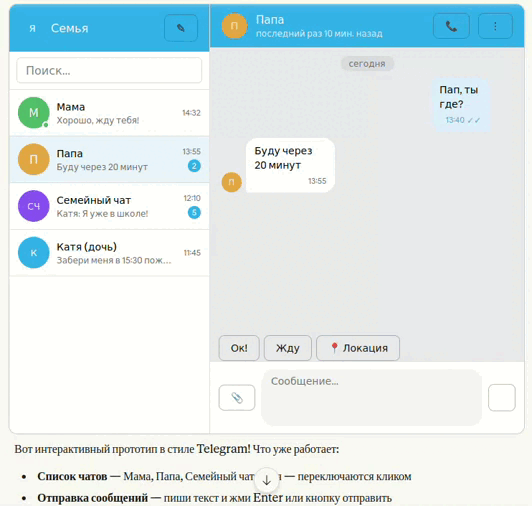

Это не просто картинка, а живой интерактивный макет:

- sidebar со списком чатов
- split-pane layout для desktop/web
- сценарии "мама", "папа", "семейный чат", "Катя"
- quick actions
- location bubble
- статусы сообщений
- поведение input-поля и отправки

По сути это был промежуточный слой между идеей и реальным Compose UI.

Сначала ИИ сделал быстрый HTML-прототип, который можно открыть, покликать,
показать семье и понять, нравится ли вообще форма продукта. И только после
этого тот же дизайн переносился в реальный KMP-клиент.

Для меня это оказался один из самых практичных сценариев вайбкодинга:

- не сразу тащить любую мысль в production-код
- сначала собрать дешёвый интерактивный прототип
- быстро проверить UX и композицию экранов
- и только потом фиксировать это в архитектуре клиента

То есть ИИ здесь использовался не только как генератор кода, но и как
инструмент продуктового и UI-прототипирования.

---

## Про вайбкодинг честно

Что ИИ делает хорошо:

- **Бойлерплейт** — Ktor-плагины, Exposed-таблицы, Koin-модули.
  То, что опытный разработчик пишет по памяти и ненавидит — ИИ делает мгновенно
- **Кроссплатформенные `expect`/`actual`** — правильно раскладывает по платформам
  без подсказок
- **Консистентность** — если дать правила (цветовая система, структура файлов,
  naming conventions), держит их по всему проекту лучше, чем команда джунов
- **Рефакторинг** — «вынеси это в отдельный модуль» работает с первого раза
- **Прототипирование UI** — интерактивный HTML-прототип экрана быстрее чем Figma,
  и сразу видно как работает UX

Где без головы не обойтись:

- **Архитектурные решения** — ИИ предложит, но выбирать тебе.
  `ClientCore.kt` в один файл — это его решение, и оно спорное
- **Баги на стыке платформ** — KMP-специфика, где `actual` ведёт себя
  неожиданно на iOS или JS. Тут нужно понимать что происходит
- **Инфра** — `systemd`, `Caddy`, два окружения prod/dev.
  ИИ напишет конфиги, но отлаживать ssh-сессию будешь сам
- **Безопасность внешнего доступа** — ИИ может накидать конфигов, но решение
  про `HTTP`, `HTTPS`, домен, self-signed и реальные риски всё равно принимаешь ты
- **Требования** — это твоя работа. ИИ строит то, что ты описал.
  Если описал неточно — получишь точно то, что описал
- **Code review** — ИИ нарушает собственные правила.
  Цвета вдруг оказываются хардкодом, строки — без локализации.
  Статический анализ и code review никуда не делись

---

## Workflow который работает

За несколько недель выработался паттерн:

1. **Прототип в чате** — сначала интерактивный HTML/SVG прямо в диалоге.
   Показываешь семье, собираешь фидбек, итерируешь. Дёшево.
2. **План для агента** — когда прототип утверждён, пишешь план:
   какие файлы создать, какие изменить, что проверить.
   Claude Code читает `CLAUDE.md` и знает архитектуру.
3. **Code review** — агент делает, ты проверяешь.
   Особенно внимательно на границах: платформ, модулей, правил.
4. **Правила в `CLAUDE.md`** — единственный способ масштабировать консистентность.
   Написал правило один раз — агент держит его во всех новых файлах.

Главный инсайт: **вайбкодинг — это не «скажи и получи»**.
Это «опиши инварианты, проверь результат, уточни правила».
Разница с обычной разработкой — в скорости итерации, не в отсутствии мышления.

---

## Итог

Проект занял 3 дня выходных вместо нескольких месяцев.

Кроссплатформа на KMP + Compose Multiplatform — реально работает.
Один UI на Android, iOS, Desktop и Web — не маркетинг, а факт.

Вайбкодинг — не замена инженерному мышлению. Это инструмент,
который убирает трение между «придумал» и «работает».

И ещё один важный вывод: ИИ может очень быстро довести продукт до состояния
"оно живое и им уже пользуются", но это не отменяет последний инженерный километр.
Сетевые риски, доверенный TLS, домен, операционная модель и поддержка семьи —
это всё ещё не про автокомплит, а про ответственность автора.

Исходники: **https://github.com/hram/family-messenger** — issues и звёздочки приветствуются.
