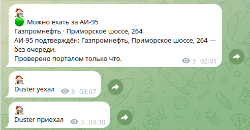
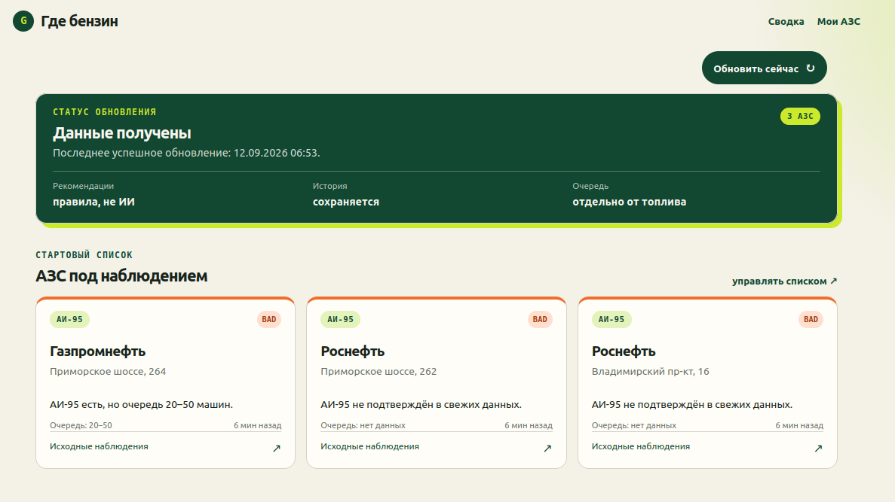
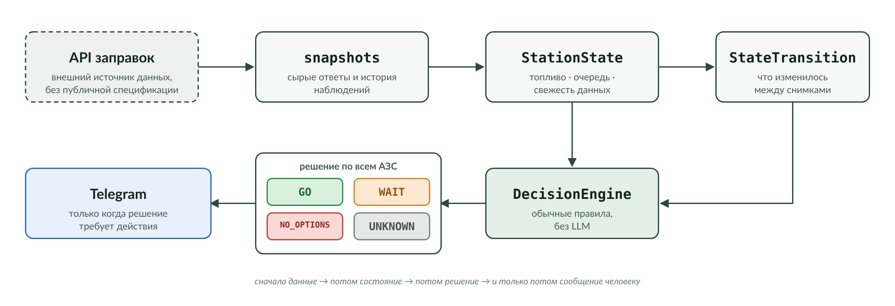
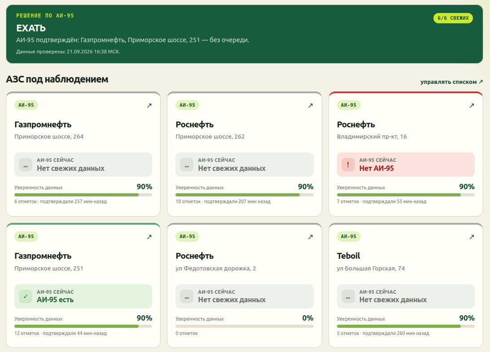
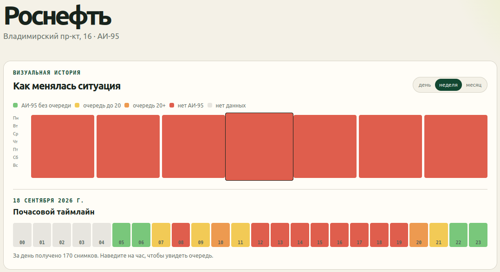
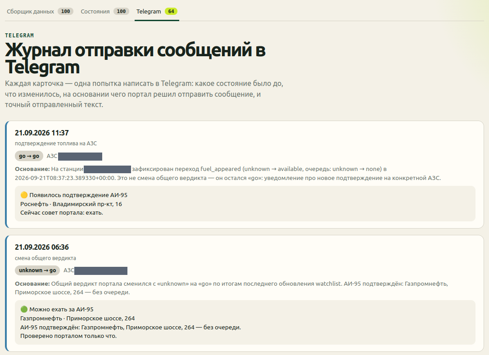

# Мне не нужен был ещё один мониторинг АЗС. Мне нужен был ответ: ехать заправляться сейчас или ждать

В какой-то момент из-за дефицита бензина обычная бытовая задача превратилась в маленький операционный процесс.

У меня есть несколько АЗС, на которые имеет смысл ехать. Нужен только АИ-95. Сам факт появления бензина ещё ничего не означает: можно приехать и обнаружить очередь на десятки машин. Данные быстро устаревают, а постоянно открывать сайт и проверять ситуацию вручную не хочется.

В итоге я сделал для себя небольшой портал. Но самое интересное произошло не тогда, когда AI-агент написал первый рабочий MVP, а чуть позже — когда я посмотрел на него и понял, что автоматизировал не ту часть задачи.

Мне был нужен не мониторинг.

Мне был нужен ответ:

> **Ехать сейчас или ждать?**

---

## В 02:01 портал написал: «Можно ехать»

Однажды ночью в Telegram пришло сообщение:

> 🟢 Можно ехать за АИ-95

Портал указал подходящую АЗС и сообщил, что очереди нет.

Я не поехал мгновенно. Решение всё равно остаётся за человеком: можно собраться специально, можно заехать по пути, а можно вообще пропустить этот момент.

Примерно через час я решил воспользоваться возможностью.

Домашняя автоматизация зафиксировала:

- `03:07` — машина уехала;
- `03:30` — машина приехала.

То есть вся поездка заняла около 23 минут.



Самое ценное здесь даже не то, что рекомендация оказалась полезной. Важно другое: до этого момента мне не пришлось сидеть перед экраном и мониторить ситуацию.

Система сделала это сама.

Но до такого поведения проект дошёл не сразу.

---

## Данные уже были. Проблема оставалась

Когда возникает массовая проблема, довольно быстро появляются сервисы, которые начинают собирать информацию вокруг неё.

С бензином произошло то же самое: можно было открыть сайт и посмотреть сообщения о наличии топлива, очередях и состоянии конкретных АЗС.

Это полезно, но для моей задачи недостаточно.

Каждая проверка всё равно выглядела примерно так:

1. открыть сервис;
2. найти интересующие меня АЗС;
3. проверить именно АИ-95;
4. посмотреть очереди;
5. понять, насколько свежие данные;
6. сравнить несколько вариантов;
7. решить, стоит ли сейчас ехать.

А потом через некоторое время повторить всё сначала.

То есть данные уже существовали. Не было персонального слоя, который бы знал мои критерии и делал рутинную часть работы за меня.

---

## Первый MVP: несколько `curl`, описание проблемы и готовый шаблон

Первую версию я делал с помощью coding agent.

Какой именно это был агент, я уже не помню, и для этой истории это несущественно.

Я дал ему:

- описание проблемы;
- примерно 5–6 примеров `curl`, по которым можно было понять доступный API;
- требование использовать мой готовый шаблон FastAPI-проекта.

Дальше агент сам разобрал структуру данных, подготовил проектную документацию и реализовал MVP.

В нём уже были:

- поиск АЗС;
- добавление нужных станций в наблюдаемые;
- периодический сбор данных;
- история;
- экран с текущим состоянием выбранных АЗС.

По git-истории первый commit с планом появился 12 сентября в `09:24`, а commit с MVP — в `11:44`.

Это не означает «2 часа 20 минут человеческой работы»: git не показывает, сколько времени человек реально сидел над задачей и что происходило внутри agent session. Но хорошо показывает темп, с которым из довольно сырого входа появился работающий продукт.



И вот здесь произошёл самый важный поворот проекта.

---

## Работало. Но решало не тот вопрос

Первый MVP был нормальным.

Он собирал данные. Показывал мои АЗС. Давал текущий срез. То есть технически выполнял исходную постановку.

Но когда я увидел экран целиком, стало очевидно: я всё ещё должен смотреть на несколько карточек и самостоятельно интерпретировать ситуацию.

Я автоматизировал получение данных.

Но не автоматизировал ту часть, которая меня на самом деле раздражала.

Первый вариант отвечал:

> **Что сейчас происходит на моих АЗС?**

А мне нужен был ответ:

> **Мне сейчас ехать за АИ-95 или лучше подождать?**

Я принёс уже работающий экран в ChatGPT не как coding-задачу, а на продуктовое ревью.

И это оказалось полезным разделением ролей.

Первый AI выступал исполнителем: по исходной формулировке быстро построил работающую систему.

Второй AI смотрел на результат со стороны и задавал другой вопрос: **какое решение должен получить пользователь на главном экране?**

Из этого ревью появилась идея превратить мониторинг в decision assistant.

---

## Один `status` недостаточен

На первый взгляд задача кажется простой:

```text
есть АИ-95 -> ехать
нет АИ-95 -> не ехать
```

На реальных данных это не работает.

API исходного сервиса не имеет формальной публичной спецификации, а разные части ответа могут описывать ситуацию с разной свежестью и разной семантикой.

Например, общий статус может говорить, что бензин есть, а более свежие данные одновременно указывать очередь в 20–50 машин.

Для моей задачи фраза «АИ-95 есть» сама по себе ничего не решает.

Нужно учитывать как минимум:

- подтверждено ли наличие именно АИ-95;
- насколько свежо подтверждение;
- какая очередь;
- насколько свежи данные об очереди;
- можно ли вообще доверять текущему состоянию.

Отдельно пришлось зафиксировать важное правило:

> **Отсутствие свежих данных не равно отсутствию бензина.**

Если система не знает, что происходит, она должна сказать `UNKNOWN`, а не притворяться, что топлива нет.

---

## Сырые ответы превратились в состояние станции

Между внешним API и решением появился отдельный слой нормализации.

Условно:

```text
API snapshot
    ↓
StationState
    ↓
StateTransition
    ↓
DecisionEngine
    ↓
GO / WAIT / NO_OPTIONS / UNKNOWN
```



`StationState` уже описывает ситуацию в терминах моего приложения: есть ли нужное топливо, какая очередь, когда состояние наблюдалось, насколько данные свежие.

А `DecisionEngine` смотрит сразу на все мои станции.

У него четыре результата:

- `GO` — есть хотя бы одна подходящая АЗС с подтверждённым АИ-95 и приемлемой очередью;
- `WAIT` — бензин есть, но текущие варианты меня не устраивают, например из-за очереди;
- `NO_OPTIONS` — среди наблюдаемых АЗС сейчас нет подтверждённого подходящего варианта;
- `UNKNOWN` — свежих данных недостаточно для честного решения.

Это специально обычный детерминированный алгоритм.

LLM в runtime здесь нет.

---

## Почему решение принимает не LLM

На первый взгляд в проекте, сделанном с помощью AI, хочется использовать AI везде.

Но вопрос «ехать сейчас или ждать?» как раз оказался плохим местом для генеративной модели.

Мне нужно, чтобы ответ:

- был повторяемым;
- зависел от конкретных измеримых условий;
- легко диагностировался;
- объяснялся через исходные факты;
- одинаково работал после каждого перезапуска.

Поэтому AI использовался для создания системы, анализа интерфейса, проектирования и реализации изменений.

А конечное runtime-решение построено на обычных правилах.

Это оказалось важным архитектурным разделением:

> **AI помогает строить decision system, но сама decision system не обязана быть AI-системой.**

---

## Главный экран перестал быть дашбордом

После переделки карточки АЗС никуда не исчезли.

Они нужны: иногда хочется проверить детали, сравнить станции или просто понять, на каких данных основана рекомендация.

Но теперь они стали вторичными.

Главным элементом экрана стал интегральный статус по всем наблюдаемым АЗС.

Например:

> **ЕХАТЬ**

И сразу объяснение:

> АИ-95 подтверждён: Газпромнефть, Приморское шоссе, 251 — без очереди.

А ниже уже можно посмотреть состояние каждой станции отдельно.



Для меня это принципиальная разница интерфейсов.

Первый вариант говорил:

> Вот три карточки. Разбирайся.

Второй говорит:

> Сейчас можно ехать. Вот почему. Если хочешь — ниже все исходные данные.

То есть интерфейс перевернулся:

**сначала решение → затем доказательства.**

---

## История оказалась полезна не только алгоритму

У каждой станции есть отдельная карточка с историей.

Можно смотреть ситуацию в разрезе дня, недели или месяца.

Для выбранного дня строится почасовой timeline, где видно:

- АИ-95 без очереди;
- небольшую очередь;
- большую очередь;
- отсутствие АИ-95;
- отсутствие данных.



Здесь важно не приписывать системе то, чего она пока не делает.

В проекте нет ML-модели, которая предсказывает приезд бензовоза.

Но накопленная история уже позволяет человеку самому замечать паттерны.

Например:

- в какую часть дня на конкретной АЗС чаще появляется АИ-95;
- когда обычно начинается очередь;
- есть ли повторяющиеся временные окна, когда ехать удобнее.

То есть оперативное решение делегировано алгоритму, а более глубокая интерпретация истории пока остаётся человеку.

Мне нравится такое разделение.

Не всё, что можно автоматизировать, обязательно нужно немедленно превращать в «умный прогноз».

---

## Самое сложное — научить систему молчать

После появления `DecisionEngine` я сначала считал, что основная задача решена.

Но при реальной эксплуатации появился следующий уровень проблемы.

Система стала понимать transitions:

- топливо появилось;
- очередь изменилась;
- данные восстановились;
- общий verdict поменялся.

Технически каждое такое событие интересно.

Пользователю — нет.

Например, совершенно корректная ситуация:

```text
топливо появилось
↓
очередь всё ещё слишком большая
↓
итоговый verdict = WAIT
```

Зачем мне Telegram-сообщение об этом?

Если рекомендация всё равно «не ехать», я просто получил ещё одно уведомление, которое требует внимания и ничего не меняет в моём поведении.

Так сформулировалось следующее правило:

> **Мне не интересны все переходы и промежуточные статусы. Я хочу знать только то, что можно ехать.**

После этого Telegram перестал быть журналом внутренних событий системы.

Он стал каналом actionable-событий.

Это, пожалуй, была последняя важная ступень проекта:

```text
данные
  ↓
решение
  ↓
нужно ли сейчас отвлекать человека?
```

Именно третий шаг сильнее всего отличает персонального помощника от обычного мониторинга.

---

## Но журнал событий всё равно нужен — разработчику

При этом внутри портала я оставил подробную диагностику.

Для каждого отправленного Telegram-сообщения можно увидеть:

- какое состояние было до;
- что изменилось;
- какое событие возникло;
- изменился ли общий verdict;
- почему портал решил отправить уведомление;
- какой текст в итоге ушёл в Telegram.



Это не пользовательская функция в обычном смысле.

Это audit trail.

Если система в три часа ночи говорит мне «езжай», я хочу иметь возможность потом открыть журнал и точно понять, на основании какого изменения она решила меня побеспокоить.

Для rule-based decision system это особенно удобно: причинно-следственную цепочку можно восстановить полностью.

---

## Что в итоге делал AI, а что делал я

Самый простой способ испортить эту историю — закончить её фразой «AI написал мне приложение».

Формально AI действительно сделал очень много.

Coding agent получил несколько `curl`, описание проблемы и шаблон проекта — и собрал первый работающий сервис.

Дальше с помощью AI были реализованы новые модели состояния, decision engine, transitions, Telegram, история, audit и тесты.

Но наиболее важные изменения возникали не из кода.

Первый MVP был технически рабочим. Только когда я увидел его в реальном интерфейсе, я понял, что он отвечает не на тот вопрос.

Потом уже работающий Telegram показал следующую проблему: даже правильная событийная система может быть слишком разговорчивой.

Получился примерно такой цикл:

```text
реальная проблема
    ↓
постановка задачи агенту
    ↓
работающий MVP
    ↓
человек смотрит на результат
    ↓
понимает, что автоматизировано не то
    ↓
внешнее AI-review
    ↓
новая продуктовая модель
    ↓
реальное использование
    ↓
ещё одно упрощение
```

Для меня это интереснее самого факта генерации кода.

Роль разработчика сместилась.

Я гораздо меньше занимался ручной реализацией конкретных классов и гораздо больше — вопросами:

- какую проблему система действительно должна решить;
- как понять, что первый вариант недостаточен;
- какое решение можно доверить алгоритму;
- какие данные считать достаточными;
- когда система имеет право отвлечь человека;
- действительно ли результат полезен в жизни.

AI хорошо пишет код по поставленной задаче.

Но работающий продукт иногда нужен именно затем, чтобы человек смог понять: **задачу надо было поставить иначе.**

---

## От массового сервиса до персонального помощника оказался один небольшой шаг

Я не считаю, что существующие сервисы «плохие».

У массового продукта другая задача.

Он должен показывать информацию тысячам людей с разными маршрутами, машинами, предпочтениями и терпимостью к очередям.

Он не обязан знать, что лично меня:

- интересует только АИ-95;
- волнуют только несколько конкретных АЗС;
- не устраивает определённая очередь;
- не нужно уведомлять о каждом изменении;
- нужно позвать только тогда, когда появляется практический смысл ехать.

Но поверх массового источника данных можно добавить тонкий персональный слой:

```text
чужие данные
+ мой контекст
+ мои правила
+ моя история
+ мои уведомления
= персональный decision assistant
```

Раньше подобный сервис для одного человека выглядел бы непропорционально дорогим по времени.

С AI coding agents стоимость такого эксперимента становится совсем другой.

И именно здесь для меня находится один из самых интересных вариантов применения AI в разработке: не строить очередной универсальный продукт, а быстро создавать маленькие системы, которые слишком специфичны для рынка, зато точно соответствуют жизни конкретного человека.

---

## Самым полезным оказался сервис, который большую часть времени молчит

В первой версии я построил мониторинг.

Во второй — систему принятия решения.

А в реальной эксплуатации оказалось, что нужен ещё один слой: управление моим вниманием.

В 02:01 портал сообщил, что появился подходящий вариант.

Я не следил за картой весь вечер, не обновлял страницу и не сравнивал вручную несколько АЗС.

Когда мне стало удобно, я воспользовался сообщением.

В `03:07` машина выехала.

В `03:30` вернулась.

И, пожалуй, это лучший критерий качества такого проекта.

Не количество экранов. Не число API endpoint'ов. Не наличие слова AI в архитектуре.

А то, что большую часть времени система ничего от меня не требует.

И появляется именно тогда, когда мне действительно есть что делать.
