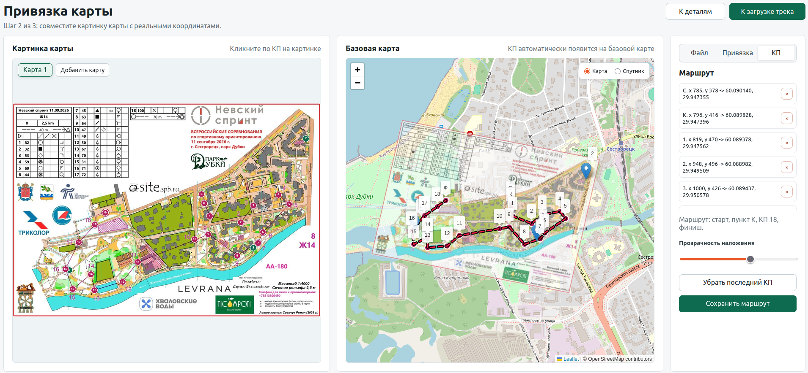
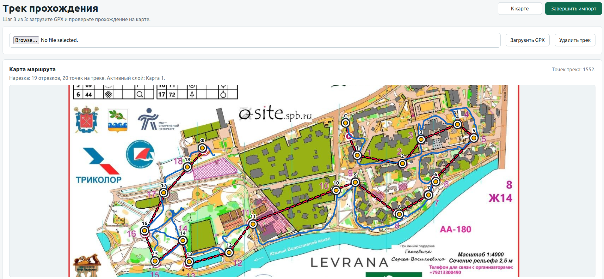
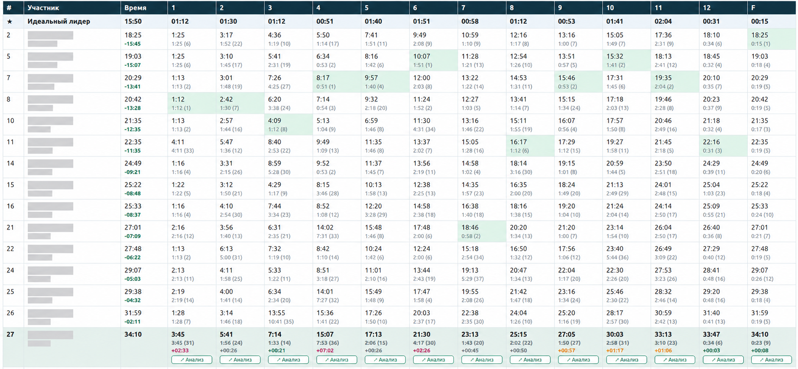
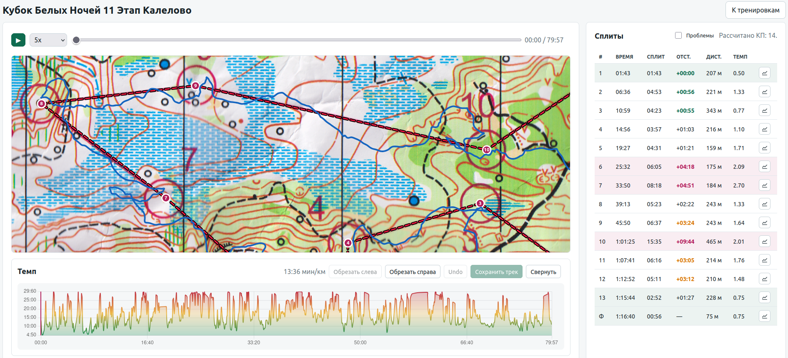
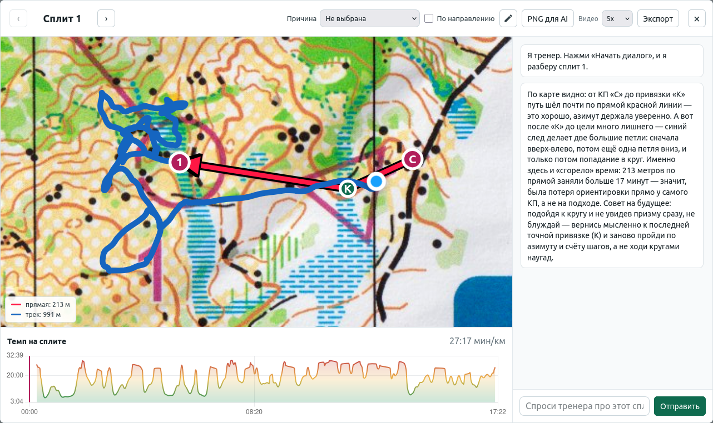
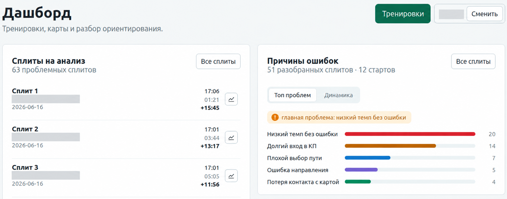

# От бумажной карты до проблемного сплита: как я сделал портал для разбора спортивного ориентирования

Почти каждую неделю у дочери соревнования по спортивному ориентированию. Иногда региональные, иногда всероссийские, иногда старты идут два или три дня подряд.

После финиша результат уже известен: место, общее время, протокол. Но для меня это только начало разбора. Гораздо интереснее понять, **где именно было потеряно время, почему это произошло и повторяется ли такая проблема от старта к старту**.

Раньше я использовал для этого другой сервис. В нём можно было посмотреть часть данных, но сам разбор оставался неудобным. Карту было сложно нормально привязать, нельзя было отметить на ней контрольные пункты и автоматически разрезать GPS-трек на сплиты, плеер не очень подходил для детального просмотра прохождения. Главное — я не мог загрузить протокол соревнований и сравнить каждый перегон с другими участниками.

В итоге данных было много, а ответа на простой вопрос не было:

**над чем конкретно нужно работать?**

Так появился мой [портал для разбора спортивного ориентирования](https://github.com/hram/orienteering).

У проекта есть ещё одна особенность: весь его код написал AI-агент. Я не видел ни одной строки исходников. Я ставил задачи, открывал результат в браузере, проверял его на реальных соревнованиях и формулировал следующую задачу. Но об этом чуть позже. Сначала — что вообще пришлось построить.

## Сначала бумажную карту нужно превратить в данные

На старте анализа у меня есть обычная спортивная карта. По сути это изображение: фотография или скан листа, на котором нанесены дистанция, старт, контрольные пункты и финиш.

GPS-трек при этом существует совсем в другом мире — в географических координатах.

Чтобы их совместить, карту сначала нужно геопривязать.

В портале это сделано в три шага. Сначала я загружаю изображение. Затем указываю минимум три соответствующие точки на спортивной карте и на обычной базовой карте. После этого изображение можно связать с реальными координатами. Внутри используется аффинное преобразование, а по нескольким опорным точкам рассчитывается привязка всей картинки.

После геопривязки я перехожу к оцифровке самой дистанции: отмечаю на изображении старт, каждый КП и финиш. Поскольку карта уже знает своё положение в реальном мире, каждый клик автоматически превращается в географические координаты контрольного пункта.

То есть на входе была картинка. На выходе появляется цифровой маршрут с последовательностью КП.

*Оцифровка спортивной карты: слева исходный скан, по центру результат наложения на базовую карту, справа — последовательность контрольных пунктов.*

## GPX загружается один раз — дальше портал сам режет его на сплиты

Следующий источник данных — GPS-трек с часов.

К этому моменту портал уже знает координаты всех КП. Поэтому после загрузки GPX ему не нужно вручную объяснять, где заканчивается один перегон и начинается следующий.

Для каждого контрольного пункта портал ищет ближайшее прохождение трека к его координатам. По этим точкам GPS-трек автоматически нарезается на сплиты: старт → КП1, КП1 → КП2 и так далее до финиша.

На карте сразу появляется фактическая траектория относительно оцифрованной дистанции.

Это кажется небольшой функцией, но именно здесь сырые точки GPS превращаются в объект, с которым уже можно работать как со спортивным результатом. Теперь у каждого перегона есть начало, конец, время, длина фактического трека и темп.

GPS, конечно, не идеален. На отдельных стартах положение точки может плавать, а момент прохождения КП не всегда идеально определяется автоматически. Поэтому в портале осталась ручная коррекция маркеров. Автоматика делает основную работу, а человек может поправить результат там, где реальные данные оказались грязными.

*После геопривязки карты и оцифровки КП загруженный GPX автоматически сопоставляется с дистанцией и нарезается на сплиты.*

## Протокол нужен не ради итогового места

После карты и трека у меня уже есть хорошее представление о том, **как** прошла дистанция. Но пока непонятно, насколько хорошо или плохо пройден каждый отдельный участок.

Для этого нужен официальный протокол соревнований.

С импортом протоколов всё оказалось не так аккуратно, как хотелось бы. Единого формата нет: портал со временем научился разбирать несколько источников и вариантов HTML, JSON и PDF, а затем появились отдельные случаи вроде многодневных стартов, эстафет и других форматов соревнований. Изменение внешнего сайта всё ещё может сломать конкретный импортёр — это неизбежная цена интеграции с чужими форматами.

Но после импорта начинается самое интересное.

Для **каждого сплита отдельно** портал находит участника, который показал на нём лучшее время. Затем эти результаты собираются в синтетическую строку, которую я называю **«Идеальный лидер»**.

Это не реальный спортсмен. Первый перегон быстрее всех мог пройти один человек, второй — другой, третий — третий. «Идеальный лидер» складывается из лучших реально показанных сплитов на всей дистанции.

И уже относительно этого эталона портал анализирует прохождение дочери.

Мне такой подход нравится больше, чем простое сравнение с победителем. Победитель соревнования мог сам где-то ошибиться. А здесь для каждого отдельного перегона есть локальный ориентир: какое лучшее время на нём вообще было показано.

В протоколе сразу видно, на каких сплитах отставание небольшое, а где произошла основная потеря времени. Хорошие и проблемные участки подсвечиваются цветом, а из любой ячейки можно открыть детальный разбор конкретного сплита.

*«Идеальный лидер» собирает лучшие времена на каждом этапе из результатов разных участников. Имена спортсменов скрыты; цветом отмечены хорошие и проблемные сплиты.*

## Один забег сначала нужно увидеть целиком

После объединения карты, GPX и протокола получается экран всего забега.

На большой карте виден полный фактический маршрут. Его можно проигрывать как запись: двигаться по времени, ускорять воспроизведение и смотреть, где находился спортсмен в конкретный момент.

Под картой расположен график темпа за весь забег. Справа — таблица сплитов с временем, длиной, отставанием и темпом.

На этом уровне портал выполняет первый автоматический анализ. Он выделяет хорошие и плохие сплиты: те участки, которые заслуживают внимания после финиша.

Здесь важно разделять две вещи. Красный сплит ещё не означает, что программа уже знает причину ошибки. Она говорит: **«вот участок, который стоит разобрать»**. Причина появляется только на следующем этапе.

Именно это избавляет меня от необходимости просматривать всю дистанцию одинаково внимательно. Если забег длился больше часа, мне не нужно вручную искать несколько самых интересных минут. Портал заранее сужает область поиска.

*Полный забег в плеере: фактическая траектория, темп и автоматическое выделение хороших и проблемных сплитов.*

## Потом вся дистанция сжимается до одного проблемного участка

Если открыть конкретный сплит, интерфейс полностью меняется.

Остальная дистанция больше не нужна. Портал вырезает только тот фрагмент спортивной карты, который относится к выбранному перегону. На нём остаётся фактический GPS-трек и прямая между двумя КП.

Это очень наглядное сравнение. Например, прямая между пунктами может быть 300 метров, а фактический трек — 820. Само по себе это ещё не доказывает ошибку: в ориентировании нельзя просто провести прямую через болото, забор или непроходимый участок. Но такой разрыв сразу заставляет внимательно посмотреть на выбор пути.

Под картой строится график темпа только для этого сплита. То есть вместо шума всей дистанции остаётся ровно тот контекст, который нужен для разбора нескольких минут прохождения.

Здесь же я могу зафиксировать причину проблемы. Когда таких разобранных участков становится много, причины начинают превращаться из заметок по отдельным соревнованиям в статистику.

*Разбор конкретного сплита: карта и трек помогают увидеть выбор пути, график — темп, а AI-тренер формулирует короткий разбор и следующий шаг.*

## Для этого же сплита можно запустить AI-ассистента

На экране сплита есть ещё один слой анализа.

Когда я запускаю AI-ассистента, ему передаётся не вся база соревнований и не текстовое описание вроде «плохо прошли пятый КП». Портал сам готовит для него контекст: делает PNG именно того участка карты, который сейчас показан на экране, вместе с треком и контрольными пунктами, добавляет числовые параметры сплита и формирует промпт.

После этого запускается Claude через CLI. AI должен посмотреть на выбранный участок, попытаться выявить проблемы прохождения и дать рекомендации.

Для меня здесь интересна не столько сама кнопка «спросить AI», сколько подготовка контекста перед ней. Большая часть работы уже сделана порталом: выбран нужный сплит, отброшена остальная дистанция, подготовлена карта, известны темп, расстояния и отставание.

То есть AI получает не мешок сырых данных, а почти готовую постановку конкретной проблемы.

При этом я пока не считаю эту часть решённой.

AI может предложить объяснение и рекомендации. Но совсем другой вопрос — **действительно ли эти рекомендации помогут изменить тренировочный процесс и уменьшат такие потери на следующих стартах**. Этого портал пока не доказал.

И именно здесь для меня сейчас проходит самая интересная граница проекта.

## Когда ошибок становится много, нужен уже не разбор старта, а статистика

Отдельный плохой сплит может быть случайностью. Поэтому на главном экране я смотрю уже не на один забег.

Слева портал собирает очередь проблемных сплитов, которые ещё стоит разобрать. В неё попадают участки с заметным отставанием и низким темпом.

Справа накапливаются причины уже разобранных проблем. И здесь появляется информация другого уровня: не «на пятом сплите в прошлое воскресенье была ошибка», а **«вот этот тип проблемы повторяется чаще остальных»**.

Например, в текущих данных главным типом может оказаться вообще не навигационная ошибка, а «низкий темп без ошибки». Это уже совсем другой разговор. Если человек правильно выбирает маршрут, не теряет карту и не уходит в сторону, но систематически проигрывает на темпе, значит следующая гипотеза о тренировках будет совсем не такой, как при постоянных ошибках направления.

На том же дашборде я вижу динамику мест на соревнованиях. Это грубая метрика — разные старты нельзя идеально сравнивать между собой, — но она даёт общий фон для более детального анализа.

*Когда разобранных сплитов становится достаточно, отдельные заметки превращаются в статистику повторяющихся причин ошибок.*

Есть ещё один экспериментальный взгляд на результат — анализ достижимости. Портал берёт участников, которые финишировали выше, группирует их по величине отставания и показывает не абстрактную дистанцию до первого места, а более близкие ступени.

Для меня это способ сформулировать реалистичный вопрос. Не «как стать первой», а, например: **сколько секунд нужно отыграть, чтобы перейти в следующую группу результатов, и можно ли найти это время в технике прохождения дистанции?**

Отдельную картинку для этого я бы в статье не ставил: основной путь пользователя уже достаточно хорошо виден на шести предыдущих экранах.

## Я не написал для этого портала ни одной строки кода

Теперь о способе разработки.

Я разработчик, но в этом проекте сознательно не работал как разработчик в привычном смысле. Я не открывал исходники и не делал code review. **100% кода портала написал AI-агент.**

Моя работа выглядела иначе.

Я видел проблему в реальном использовании и ставил задачу. Агент реализовывал её. Я открывал портал, загружал реальные данные, проходил пользовательский сценарий и смотрел, решена ли моя проблема. Если нет — формулировал следующую задачу.

Именно так постепенно появились геопривязка, автоматическая нарезка GPX, импорт разных протоколов, сравнение сплитов, карточка анализа, причины ошибок, дашборд и AI-ассистент.

Критерием приёмки для меня был не код, а работающий продукт.

Это не значит, что техническая сторона совсем ничем не контролируется. В репозитории есть автоматические тесты; на проверенном состоянии проекта полный прогон давал `109 passed`. Но сам я оценивал систему снаружи — как пользователь, который знает, какой результат ему нужен.

Такой режим сильно меняет роль человека. Если агент полностью забрал написание кода, главный вопрос уже не «как это реализовать?», а **«что вообще нужно реализовать следующим?»**

И этот вопрос агент за меня не решал.

## Самая сложная проблема появилась после того, как портал начал работать

С технической точки зрения сейчас портал умеет уже довольно много.

Он превращает изображение спортивной карты в цифровую дистанцию. Накладывает GPX. Автоматически режет его на сплиты. Подтягивает официальный протокол. Строит «Идеального лидера». Показывает, где потеряно время. Даёт открыть конкретный перегон. Помогает классифицировать причину. Собирает статистику повторяющихся проблем. И даже может передать выбранный участок AI для дополнительного разбора.

Но именно после этого я столкнулся с вопросом, которого в начале проекта почти не замечал:

**что делать с найденной проблемой дальше?**

Допустим, портал показывает, что главный повторяющийся фактор — низкий темп без навигационной ошибки.

Хорошо. Мы это знаем.

Но какое тренировочное действие из этого следует?

Или AI посмотрел на несколько проблемных сплитов и дал рекомендации. Как понять, что они правильные? Как превратить их в конкретное упражнение? Как проверить через несколько недель, что именно эта проблема стала встречаться реже?

Пока у меня нет хорошего ответа.

И, пожалуй, это самый полезный результат всего проекта. Сначала мне казалось, что главное — научиться собирать данные и находить ошибки. Теперь эта часть всё больше автоматизируется, а сложность перемещается дальше: **из диагностики в изменение поведения и тренировочного процесса**.

## Зачем я продолжаю это делать

Мы анализируем все старты вместе с женой и дочерью. Открываем трек, смотрим потерянные минуты, обсуждаем, что произошло на конкретном участке.

Я пока не могу сказать, что портал сделал её результаты лучше. Для такого вывода у меня нет данных.

Но у проекта есть ещё одна цель, которую вообще сложно измерить графиком.

Я надеюсь, что дочь видит нашу вовлечённость. Что её соревнования для нас — не просто «ну как пробежала?», а что нам действительно интересно вместе посмотреть карту, понять ошибку и заметить прогресс.

Если портал в итоге поможет ещё и превратить статистику ошибок в хорошие тренировочные решения — отлично.

Но даже сейчас он уже решил первую задачу: вместо общей оценки результата у нас появился предметный разговор о конкретных участках дистанции.

И это оказалось гораздо полезнее, чем просто знать место на финише.
