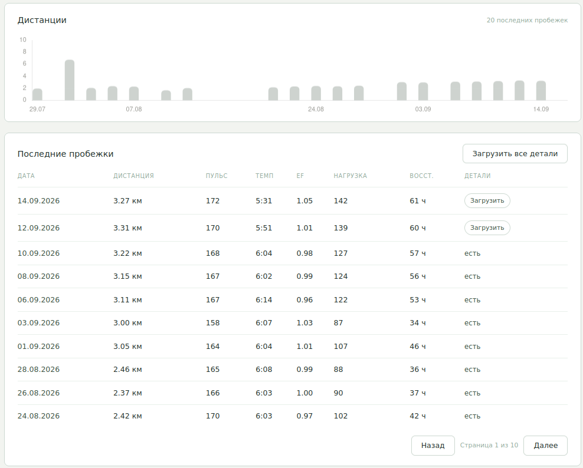
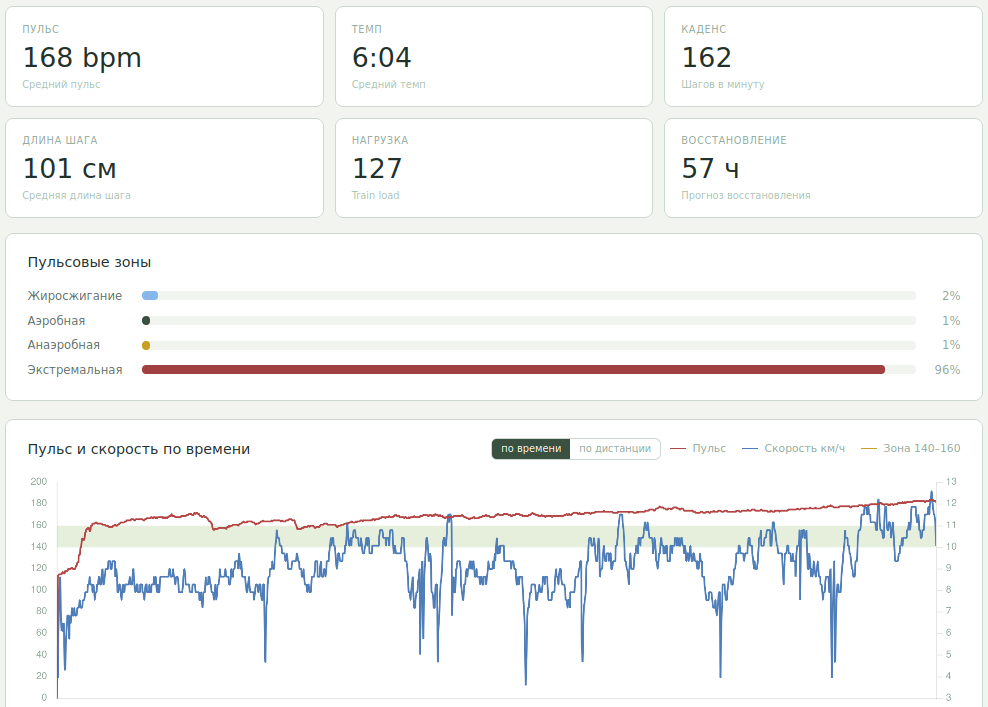
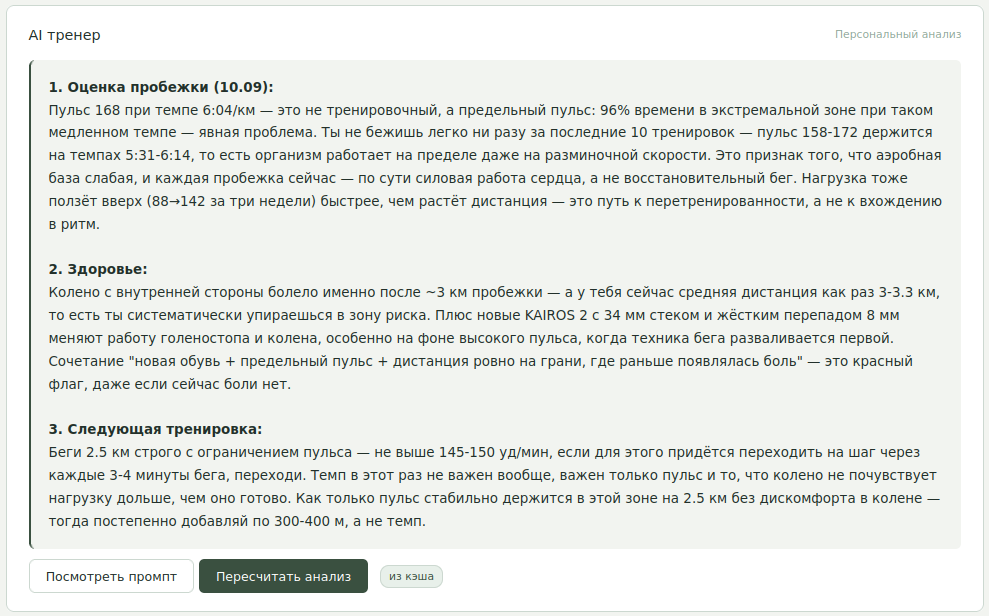
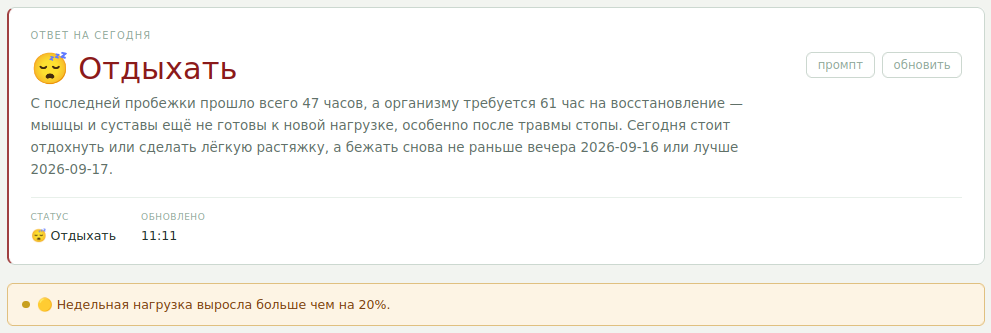
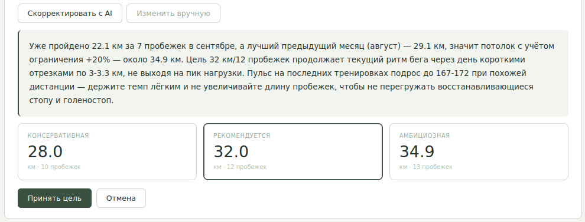
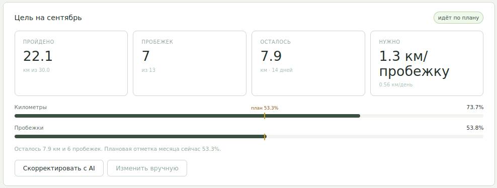

# Как я сделал AI персональным тренером, которому наконец доступны все мои тренировки

В октябре 2025 года я решил вернуться к бегу после перерыва больше десяти лет. Когда-то я бегал практически каждый день, потом надолго выпал из этого режима, а возвращаться решил уже с часами, треками и всеми теми данными, которых раньше у меня просто не было.

Очень быстро выяснилось, что сами часы — только половина решения.

Они исправно записывали дистанцию, пульс, темп, каденс, нагрузку, восстановление и другие метрики. Но приложение производителя оказалось плохим инструментом именно для того, чего мне хотелось больше всего: не просто посмотреть очередную пробежку, а понять, нормально ли я восстанавливаюсь, не слишком ли быстро повышаю нагрузку и что мне делать на следующей тренировке.

Я хотел персонального тренера и решил попробовать ChatGPT.

После пробежки открывал приложение, делал несколько скриншотов и загружал их в чат. На словах схема выглядела нормально: часы собрали данные, я показал их AI, AI дал разбор.

На практике она быстро развалилась.

## Скриншотов оказалось мало

На один скриншот вся тренировка не помещается. Отдельно сводка, отдельно графики, отдельно зоны пульса, отдельно другие показатели. Чем подробнее я хотел получить анализ, тем больше вручную приходилось собирать исходные данные.

Особенно плохо этот подход работал с графиками. Человек ещё может глазами связать несколько экранов в одну картину, а для чата я каждый раз фактически заново собирал контекст из кусочков.

Но была и более важная проблема: одна тренировка почти ничего не значит без предыдущих.

Пульс 168 сам по себе — просто число. Совсем другое дело, если до этого было 158, потом 164, 167, 168, 170 и 172 при примерно одинаковой дистанции. То же самое с нагрузкой, восстановлением и дистанцией. Для полезного совета нужна динамика.

Через скриншоты я каждый раз приносил AI маленький фрагмент того, что уже знало приложение часов.

В какой-то момент стало понятно: проблема не в том, чтобы придумать более хороший промпт. Мне нужен нормальный канал между данными часов и AI.

## Я сделал слой между Mi Fitness и AI

Так появился [`running-portal`](https://github.com/hram/running-portal).

Он синхронизирует мои беговые тренировки из Mi Fitness, хранит историю и позволяет загружать подробные данные конкретной пробежки. Для человека это обычный журнал тренировок. Для AI — постоянный источник контекста.

Саму работу с приватным API Mi Fitness я не исследовал с нуля. Я нашёл open-source проект [Mi-Fitness-Sync автора kevinkwee](https://github.com/kevinkwee/Mi-Fitness-Sync), опубликованный под MIT License. В нём уже были реализованы авторизация Xiaomi, получение тренировок и разбор детальных данных Mi Fitness. Эту реализацию я использовал как основу для модуля синхронизации своего портала.

Это важная оговорка: AI-агент написал сам running-portal и интегрировал этот код в него, но reverse engineering протокола Mi Fitness — не наша работа. За эту часть спасибо автору Mi-Fitness-Sync.



*Журнал тренировок. Здесь AI ещё не участвует — это слой данных, которым он потом пользуется.*

На этом экране никакого AI нет. И это важная деталь.

Портал просто хранит факты: дату, дистанцию, средний пульс, темп, Efficiency Factor, нагрузку, расчётное восстановление и наличие детальных данных. Именно эта скучная часть и делает всё остальное возможным.

Если упростить архитектуру до сути, она выглядит так:

```text
Mi Fitness
    ↓
синхронизация
    ↓
running-portal
    ├── история пробежек
    ├── детальные метрики
    ├── графики
    ├── состояние / самочувствие
    └── месячная цель
            ↓
        AI-тренер
```

Под капотом интеграция с Mi Fitness получилась не самой приятной: используется приватный API и внутренние форматы данных, в том числе отдельные файлы с подробными сериями значений. Это одна из причин, почему я воспринимаю портал как персональный инструмент, а не как основу будущего публичного сервиса.

Но после того как синхронизация заработала, задача AI-тренера изменилась радикально.

Ему больше не нужно смотреть на картинку.

## Одна пробежка теперь приходит к тренеру как данные

Карточка тренировки показывает мне те же вещи, которые потом можно передать модели уже в структурированном виде: пульс, темп, каденс, длину шага, нагрузку, восстановление, распределение по пульсовым зонам и подробные временные серии.



*Детальные данные одной пробежки. Для меня это графики, для AI — исходные числовые данные.*

Это принципиальная разница с первоначальными скриншотами.

Раньше я показывал AI визуальное представление данных. Теперь портал сам собирает факты и формирует контекст.

Примерно так выглядит сокращённый фрагмент реального промпта тренера:

```text
=== ПРОБЕЖКА ===
Дистанция: 3.216 км
Пульс: 168 уд/мин
Темп: 6:04/км
Каденс: 162 ш/мин
Нагрузка: 127
Восстановление: 57 ч
Пульсовые зоны: ... экстремальная 96%

=== ПОСЛЕДНИЕ ПРОБЕЖКИ ===
14.09: 3.271 км, пульс 172, нагрузка 142
12.09: 3.307 км, пульс 170, нагрузка 139
10.09: 3.216 км, пульс 168, нагрузка 127
...

=== ОТВЕТ ===
1. Оценка пробежки.
2. Риски с учётом текущего состояния.
3. Одна конкретная рекомендация на следующую тренировку.
```

В реальном запросе данных больше. Туда попадает не только текущая пробежка, но и история последних тренировок и сохранённый контекст о состоянии.

Сам шаблон промпта я могу менять из интерфейса портала.

Для меня это важное разделение ответственности. Код собирает факты. Я задаю правила и формат анализа. Модель интерпретирует контекст и формирует ответ.

## AI-анализ — это уже следующий слой

Результат анализа отображается прямо в карточке пробежки.



*AI-разбор той же тренировки: оценка → риски → конкретная следующая тренировка.*

На примере со скриншота тренер обращает внимание не только на средний пульс, но и на то, что большая часть тренировки прошла в высокой пульсовой зоне, сопоставляет это с предыдущими пробежками и предлагает не увеличивать нагрузку.

Мне как раз хотелось получить не очередную фразу «хорошая тренировка, продолжай», а конкретный ответ: что в этой пробежке выглядит плохо и что делать в следующий раз.

Причём я специально задал в промпте жёсткую структуру ответа. Мне не нужен поток спортивной мотивации. Нужны три вещи: оценка, риски и следующая тренировка.

В этом месте я окончательно перестал воспринимать промпт как магический текст, который должен решить задачу сам.

Полезность появилась прежде всего из-за контекста.

## Есть ещё более короткий вопрос: можно ли мне сегодня бежать?

Кроме подробного анализа тренировки у портала есть ежедневная рекомендация.

Она отвечает на простой практический вопрос: сегодня бежать, бежать легко или отдыхать?



*Ежедневная рекомендация. На момент скриншота после пробежки прошло меньше расчётного времени восстановления, а тренер дополнительно учитывает историю нагрузки и контекст.*

Здесь я не отдаю решение модели полностью.

В промпте есть явные правила. Например, если расчётное время восстановления после предыдущей тренировки ещё не прошло, это один из сигналов в пользу отдыха. Отдельно учитываются высокий пульс, нагрузка и сохранённые записи о состоянии.

А портал автоматически подставляет факты:

```text
последняя пробежка
+ сколько времени прошло
+ последние 7 пробежек
+ нагрузка
+ восстановление
+ сохранённый контекст
```

После этого модель формулирует короткое объяснение.

Мне нравится именно такая конструкция: часть guardrails задана явно, а LLM используется там, где нужно связать несколько факторов и объяснить рекомендацию человеческим языком.

## Самым полезным тренер оказался тогда, когда мне хотелось бежать больше

Во время возвращения к регулярным тренировкам у меня были проблемы со стопами. Позже долго беспокоило колено.

Я не хочу делать из этого медицинскую success story. AI ничего мне не «вылечил» и не заменял врача.

Но он оказался полезным в другой роли — как дополнительный ограничитель моей собственной склонности повышать нагрузку быстрее, чем стоило.

Когда в контексте появлялась боль, тренер снижал рекомендуемую нагрузку, предлагал паузу и советовал обратиться к врачу. После того как я купил новые 361 KAIROS 2, информация о смене обуви тоже была добавлена в контекст. Для тренера это стало ещё одним фактором, из-за которого не стоит резко увеличивать объём.

Позже похожая история была с коленом: вместо попытки любой ценой выполнить очередную цифру портал оставлял в контексте информацию о проблеме, а AI продолжал учитывать её в следующих рекомендациях.

Сейчас боли прошли, и я бегаю стабильно. Но именно этот период показал мне, зачем вообще нужен долговременный контекст.

Разовый чат легко забывает, что было две недели назад. Портал — нет.

## От следующей тренировки к цели на месяц

Когда основная задача была «вернуться к бегу и не форсировать», мне хватало рекомендаций после каждой тренировки.

Потом задача изменилась.

Сейчас мне интереснее понять, какой объём поставить на следующий месяц и как двигаться к нему без резких скачков.

Для этого в начале месяца AI анализирует предыдущие пробежки и предлагает три варианта цели: консервативную, рекомендуемую и амбициозную.



*AI не устанавливает цель сам. Он предлагает три сценария и объясняет рекомендуемый вариант; окончательное решение принимаю я.*

Мне нравится, что здесь тоже нет автоматического «AI решил — человек выполняет».

Модель предлагает варианты. Я выбираю.

После принятия цели AI для контроля уже почти не нужен: обычный код портала считает пройденные километры, количество пробежек, остаток до цели и показывает, идёт ли месяц по плану.



*После выбора цели портал сам отслеживает выполнение: километры, количество пробежек, остаток и отклонение от плана.*

Это хорошо иллюстрирует то, как я в итоге использую LLM в проекте.

Там, где достаточно арифметики, должна быть арифметика.

Там, где нужно интерпретировать историю и предложить несколько разумных сценариев, появляется AI.

## А кто написал сам портал?

Сам running-portal на 100% реализован coding agents по моим постановкам. Исключение — низкоуровневая интеграция с Mi Fitness: её основой стал open-source проект Mi-Fitness-Sync под MIT License.

Я сознательно не хочу превращать эту статью в разбор того, как агент писал FastAPI, JavaScript или SQL. Для меня здесь это вторично.

Но сам процесс получился интересным.

Портал не был один раз сгенерирован большим промптом и забыт. Я начал им пользоваться, увидел следующую потребность, сформулировал её агенту, проверил результат и продолжил пользоваться уже новой версией.

В репозитории сохранилось 11 prompt-артефактов разных этапов. В них последовательно появлялись синхронизация, frontend, AI-тренер, графики, аналитика, месячные цели и другие улучшения. Полную историю каждой agent-сессии по ним уже не восстановить, поэтому я не хочу выдавать число файлов за точный журнал разработки.

Для этой истории важнее другое:

```text
использую портал
      ↓
вижу, чего не хватает
      ↓
формулирую задачу coding agent
      ↓
получаю изменение
      ↓
снова использую портал
```

Это продолжается до сих пор.

В результате получился довольно забавный замкнутый контур: один AI помогает мне развивать инструмент, а другой AI внутри этого инструмента работает уже с моими тренировками.

## Это не универсальный цифровой тренер

У проекта есть ограничения, и они для меня вполне приемлемы.

Это персональный портал для одного пользователя. Он зависит от приватных механизмов Mi Fitness, которые могут измениться. Внутри простая архитектура с FastAPI и SQLite. Часть фоновой работы выполняется прямо в процессе приложения. Это не продукт, который я прямо сейчас готов раздавать тысячам пользователей.

И AI-тренер тоже не является медицинской системой.

Даже хороший контекст не делает ответ модели медицинским фактом. Я воспринимаю рекомендации как ещё один источник обратной связи о нагрузке, а не как диагностику или назначение лечения.

Наверное, именно поэтому персональный формат здесь мне подходит лучше всего. Я понимаю, откуда взялись данные, вижу промпт, могу его изменить и знаю ограничения всей цепочки.

## Вместо хорошего промпта мне понадобилась инфраструктура контекста

Когда я начинал отправлять скриншоты тренировок в ChatGPT, мне казалось, что задача сводится к одному: научиться правильно спрашивать.

Оказалось, что хороший вопрос — самая маленькая часть системы.

Часы уже умели собирать данные. LLM уже умела рассуждать по ним. Между ними не хватало слоя, который автоматически сохраняет тренировочную историю, поднимает нужные детали, добавляет актуальный контекст и отдаёт модели всё это в предсказуемом виде.

Для меня `running-portal` стал именно таким слоем.

Сейчас я продолжаю бегать, приближается год с момента возвращения после большого перерыва. Все тренировки попадают в портал. После пробежки я могу получить подробный разбор, перед следующей — рекомендацию по нагрузке, а в начале месяца — несколько вариантов цели и затем контроль её выполнения.

И самый интересный результат для меня здесь не в том, что AI смог написать ещё одно веб-приложение.

А в том, что благодаря этому приложению AI перестал быть собеседником, которому я после каждой пробежки вручную показываю несколько картинок, и стал инструментом, который действительно видит историю моего бега.

Исходный код [`running-portal`](https://github.com/hram/running-portal) открыт на GitHub. Если вам оказался близок такой способ работы с тренировочными данными и AI — поставьте проекту звёздочку. И особенно буду рад предложениям по развитию и сообщениям об ошибках: для личного инструмента это самый полезный способ понять, где он может стать лучше.
